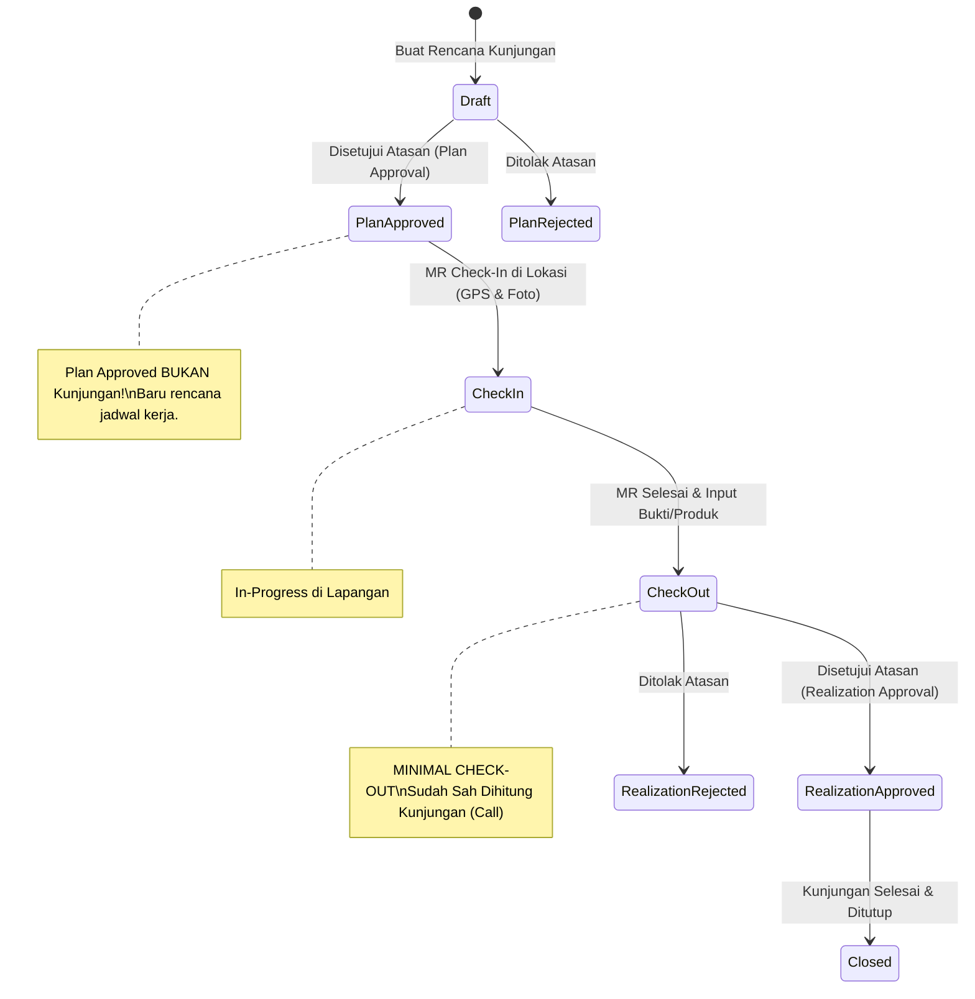
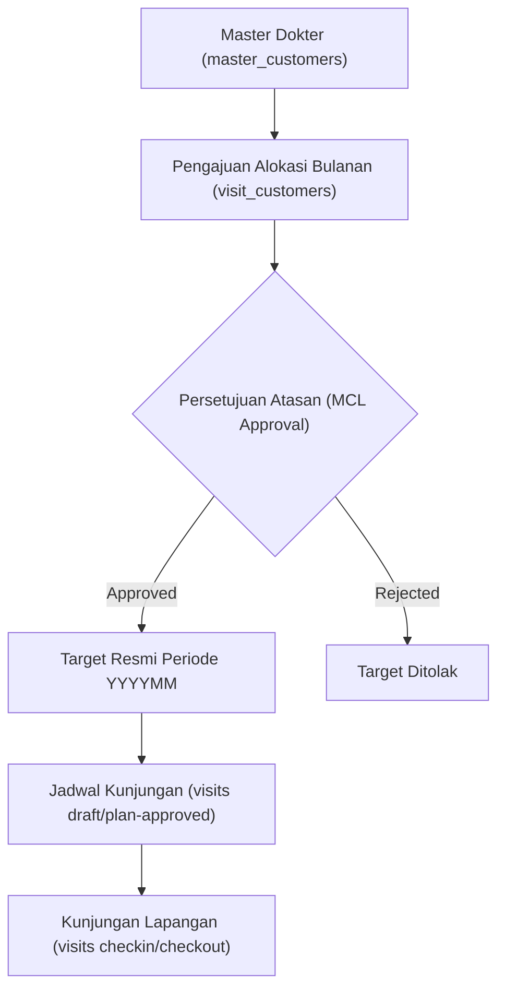

# Workflow & Diagram VisitFlow

Dokumentasi alur proses bisnis utama sistem VisitFlow.

---

## 1. Alur Siklus Hidup Kunjungan (Visit Lifecycle)

---

## 2. Alur Master Customer List (MCL)

---

## 3. Alur Presensi & Cuti (Presence & Leave)

- **Presensi Harian**: Check-in (wajah + GPS kantor) $\rightarrow$ Aktivitas kerja $\rightarrow$ Check-out (wajah + GPS).
- **Cuti**: Pengajuan (`input`) $\rightarrow$ Validasi kuota cuti tahun lalu & tahun ini $\rightarrow$ Approval Boss $\rightarrow$ Approval HRD (`approved hrd`).
- **Koreksi Absensi**: Pengajuan (`input`) $\rightarrow$ Approval Boss $\rightarrow$ Approval HRD $\rightarrow$ Mutasi ke tabel presensi.
