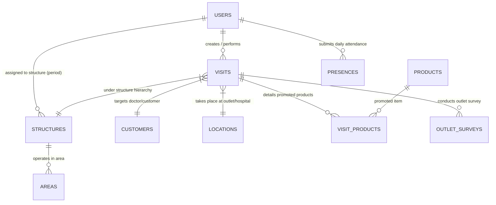

# VisitFlow Database Schema & Query Optimization Reference

> **Status:** Referensi struktur historis; bukan bukti kondisi database live atau angka operasional hari ini.
> **Recorded target:** `VISITFLOW_MF_PROD` (tidak otomatis memilih target koneksi).
> **Recorded period:** `202609`, bukan periode aktif yang harus dipakai untuk semua pertanyaan.
> **Scope note:** Dokumen ini menyebut 74 base tables / 19 views / 14 procedures; katalog bertanggal 2026-09-24 menyebut 89 base tables / 20 views. Angka antar dokumen berbeda; penyebabnya belum diverifikasi. Rekonsiliasi dengan metadata target sebelum membuat klaim kelengkapan.
> **Agent workflow:** Ikuti [AGENTS.md](AGENTS.md). Telusuri kode lalu baca struktur tabel yang relevan; cocokkan dengan model, query, dan metadata target jika tersedia. Hasil data harus berasal dari query yang dieksekusi. SQL dump juga berisi INSERT: ambil hanya DDL yang diperlukan dan jangan menampilkan data baris.

---

## 1. High-Level Entity Relationship Flow

---

## 2. AI Agent Query Optimization Rules (Best Practices)

Use these checks with the actual query, business rules, and target metadata. They are not guarantees of an execution plan or response time.

1. **Scope and period:** Match company, ownership, soft delete, and the requested business period. `structures` can contain monthly snapshots; join using the complete business key and requested period(s). Do not hardcode `202609` or exclude historical periods needed by the question.
2. **Composite indexes:** Inspect existing leftmost prefixes, equality/range predicates, join cardinality, ordering, and write cost. Equality/sort/range ordering is a candidate, not a universal rule; verify with plain `EXPLAIN` and representative measurements.
3. **Date ranges:** Prefer `column >= start AND column < next_day` after verifying timezone/storage semantics. A range makes index use possible; it does not guarantee an index scan or low latency.
4. **Projection:** Select columns needed by the response. Exclude large text/blob fields from counts and summaries. Preserve required response fields when changing existing endpoints.
5. **Pagination:** Large offsets can require substantial scanning. Consider keyset pagination with deterministic ordering and a tie-breaker when compatible with API requirements; benchmark rather than label it instant.
6. **Related data:** Check query counts and N+1. Compare bounded batch reads, scoped preloads, and joins; verify that one-to-many joins do not multiply the aggregate. Select explicit columns instead of blindly copying `SELECT *`.
7. **Aggregates:** Consider covering indexes when supported by measured workload. Include storage/write overhead, existing indexes, and correctness of counts. Do not create indexes or run `EXPLAIN ANALYZE`/load tests merely to answer a conceptual question.

---

## 3. Data Dictionary by Domain (historical scope)

### 1. CRM Core & Visits Management

#### Table: `visits`

| Column Name | Type / Definition |
| :--- | :--- |
| `id` | `bigint unsigned NOT NULL AUTO_INCREMENT` |
| `created_at` | `datetime(3) DEFAULT NULL` |
| `updated_at` | `datetime(3) DEFAULT NULL` |
| `deleted_at` | `datetime(3) DEFAULT NULL` |
| `created_by_id` | `bigint unsigned DEFAULT NULL` |
| `updated_by_id` | `bigint unsigned DEFAULT NULL` |
| `deleted_by_id` | `bigint unsigned DEFAULT NULL` |
| `status` | `varchar(20) CHARACTER SET utf8mb4 COLLATE utf8mb4_bin DEFAULT NULL` |
| `type` | `varchar(50) COLLATE utf8mb4_bin DEFAULT NULL` |
| `title` | `longtext CHARACTER SET utf8mb4 COLLATE utf8mb4_bin` |
| `structure_id` | `varchar(30) CHARACTER SET utf8mb4 COLLATE utf8mb4_bin DEFAULT NULL` |
| `period` | `varchar(6) CHARACTER SET utf8mb4 COLLATE utf8mb4_bin NOT NULL` |
| `customer_category` | `varchar(50) CHARACTER SET utf8mb4 COLLATE utf8mb4_bin NOT NULL DEFAULT 'USER'` |
| `customer_id` | `varchar(20) CHARACTER SET utf8mb4 COLLATE utf8mb4_bin NOT NULL` |
| `type_visit` | `varchar(191) CHARACTER SET utf8mb4 COLLATE utf8mb4_bin DEFAULT '-'` |
| `checkin_time` | `datetime(3) DEFAULT NULL` |
| `checkout_time` | `datetime(3) DEFAULT NULL` |
| `schedule_datetime` | `datetime(3) DEFAULT NULL` |
| `schedule_end` | `datetime(6) DEFAULT NULL` |
| `check_in_radius` | `double DEFAULT NULL` |
| `location_id` | `varchar(20) CHARACTER SET utf8mb4 COLLATE utf8mb4_bin NOT NULL` |
| `check_out_radius` | `double DEFAULT NULL` |
| `approved_structure_id` | `longtext CHARACTER SET utf8mb4 COLLATE utf8mb4_bin` |
| `approved_time` | `datetime(3) DEFAULT NULL` |
| `approved_note` | `varchar(500) COLLATE utf8mb4_bin DEFAULT NULL` |
| `closed_structure_id` | `longtext CHARACTER SET utf8mb4 COLLATE utf8mb4_bin` |
| `closed_time` | `datetime(3) DEFAULT NULL` |
| `proof_photo` | `varchar(100) CHARACTER SET utf8mb4 COLLATE utf8mb4_bin DEFAULT NULL` |
| `proof_signature` | `varchar(100) CHARACTER SET utf8mb4 COLLATE utf8mb4_bin DEFAULT NULL` |
| `note` | `varchar(500) CHARACTER SET utf8mb4 COLLATE utf8mb4_bin DEFAULT NULL` |
| `company_id` | `bigint NOT NULL` |
| `checkin_latitude` | `double DEFAULT NULL` |
| `checkout_latitude` | `double DEFAULT NULL` |
| `checkin_longitude` | `double DEFAULT NULL` |
| `checkout_longitude` | `double DEFAULT NULL` |
| `location_latitude` | `double DEFAULT NULL` |
| `location_longitude` | `double DEFAULT NULL` |
| `customer_name` | `longtext CHARACTER SET utf8mb4 COLLATE utf8mb4_bin` |
| `customer_phone` | `longtext CHARACTER SET utf8mb4 COLLATE utf8mb4_bin` |
| `location_name` | `longtext CHARACTER SET utf8mb4 COLLATE utf8mb4_bin` |
| `user_name` | `longtext CHARACTER SET utf8mb4 COLLATE utf8mb4_bin` |
| `location_address` | `longtext CHARACTER SET utf8mb4 COLLATE utf8mb4_bin` |
| `accuracy` | `double DEFAULT NULL` |
| `is_survey` | `tinyint(1) DEFAULT NULL` |
| `is_mandatory` | `tinyint(1) DEFAULT NULL` |
| `out_of_city` | `tinyint(1) DEFAULT NULL` |

**Indexes & Keys:**
- **PRIMARY KEY**: `PRIMARY KEY (`id`,`period`,`customer_id`,`location_id`,`company_id`)`
- `UNIQUE KEY `idx_visit_id` (`id`)`
- `UNIQUE KEY `idx_visit` (`structure_id`,`period`,`customer_id`,`checkin_time`,`location_id`,`company_id`)`
- `KEY `idx_visits_deleted_at` (`deleted_at`)`
- `KEY `fk_visits_created_by` (`created_by_id`)`
- `KEY `fk_locations_visit` (`location_id`)`
- `KEY `idx_visits_status` (`status`) USING BTREE`
- `KEY `idx_visits_company_id` (`company_id`) USING BTREE`
- `KEY `idx_schedule_datetime` (`schedule_datetime`) USING BTREE`
- `KEY `idx_visits_filter` (`structure_id`,`customer_id`,`location_id`,`company_id`,`period`,`deleted_at`,`status`)`
- `KEY `idx_visits_join` (`structure_id`,`customer_id`,`location_id`,`period`,`company_id`,`type`,`status`,`deleted_at`)`
- `KEY `idx_visits_customer_del` (`customer_id`,`deleted_at`,`status`)`
- `KEY `idx_visits_call` (`structure_id`,`company_id`,`period`,`customer_id`,`type`,`deleted_at`)`
- `KEY `idx_visits_heavy` (`structure_id`,`company_id`,`period`,`type`,`deleted_at`,`customer_id`,`location_id`,`status`)`
- `KEY `idx_visits_count` (`structure_id`,`company_id`,`period`,`deleted_at`,`id`)`
- `KEY `idx_visits_period_type_status_del` (`period`,`type`,`status`,`deleted_at`)`
- `KEY `idx_visits_id_period` (`id`,`period`)`
- `KEY `idx_visits_coverage` (`period`,`structure_id`,`customer_id`,`status`,`deleted_at`)`
- `KEY `idx_visits_period_cust_struct` (`period`,`customer_id`,`structure_id`)`
- `KEY `idx_visits_coverage_customer` (`period`,`structure_id`,`customer_id`,`type`,`deleted_at`,`status`)`
- `KEY `idx_visits_coverage_location` (`period`,`structure_id`,`location_id`,`type`,`deleted_at`,`status`)`
- `KEY `idx_visits_period_struct_del_checkin` (`period`,`structure_id`,`deleted_at`,`checkin_time` DESC)`
- `KEY `idx_visits_history_period_deleted_checkout` (`period`,`deleted_at`,`checkout_time` DESC)`

---

#### Table: `visit_customers`

| Column Name | Type / Definition |
| :--- | :--- |
| `id` | `bigint unsigned NOT NULL AUTO_INCREMENT` |
| `created_at` | `datetime(3) DEFAULT NULL` |
| `updated_at` | `datetime(3) DEFAULT NULL` |
| `deleted_at` | `datetime(3) DEFAULT NULL` |
| `created_by_id` | `bigint unsigned DEFAULT NULL` |
| `updated_by_id` | `bigint unsigned DEFAULT NULL` |
| `deleted_by_id` | `bigint unsigned DEFAULT NULL` |
| `period` | `varchar(6) NOT NULL` |
| `customer_name` | `varchar(100) DEFAULT NULL` |
| `customer_phone` | `varchar(100) DEFAULT NULL` |
| `priority` | `varchar(100) DEFAULT NULL` |
| `type` | `varchar(100) DEFAULT NULL` |
| `status` | `varchar(20) DEFAULT NULL` |
| `level` | `bigint unsigned DEFAULT NULL` |
| `approved_structure_id` | `varchar(30) DEFAULT NULL` |
| `approved_time` | `datetime(3) DEFAULT NULL` |
| `structure_id` | `varchar(30) NOT NULL` |
| `out_of_city` | `tinyint(1) DEFAULT '0'` |
| `user_id` | `bigint unsigned DEFAULT NULL` |
| `user_name` | `varchar(50) CHARACTER SET utf8mb4 COLLATE utf8mb4_0900_ai_ci DEFAULT NULL` |
| `customer_id` | `varchar(20) DEFAULT NULL` |
| `location_id` | `varchar(20) CHARACTER SET utf8mb4 COLLATE utf8mb4_0900_ai_ci DEFAULT NULL` |
| `company_id` | `bigint NOT NULL` |
| `rejected_structure_id` | `varchar(30) DEFAULT NULL` |
| `note` | `varchar(500) CHARACTER SET utf8mb4 COLLATE utf8mb4_0900_ai_ci DEFAULT NULL` |
| `rejected_time` | `datetime(3) DEFAULT NULL` |
| `cluster` | `varchar(50) DEFAULT NULL` |
| `amortization` | `varchar(50) DEFAULT NULL` |

**Indexes & Keys:**
- **PRIMARY KEY**: `PRIMARY KEY (`id`,`period`,`company_id`)`
- `UNIQUE KEY `idx_visit_customer` (`period`,`structure_id`,`customer_id`,`company_id`,`location_id`) USING BTREE`
- `UNIQUE KEY `uk_period_structure_customer_location` (`period`,`structure_id`,`customer_id`,`location_id`)`
- `KEY `idx_visit_customers_company_id` (`company_id`) USING BTREE`
- `KEY `idx_visit_customer_filter` (`structure_id`,`company_id`,`period`,`deleted_at`,`customer_id`,`location_id`) USING BTREE`
- `KEY `idx_vc_structure_period_company` (`structure_id`,`period`,`company_id`)`
- `KEY `idx_vc_deleted_at` (`deleted_at`)`
- `KEY `idx_vc_customer` (`customer_id`)`
- `KEY `idx_vc_location` (`location_id`)`
- `KEY `idx_visit_customers_period_status_loc_del` (`period`,`status`,`deleted_at`,`location_id`,`structure_id`,`customer_id`)`
- `KEY `idx_vc_period_company_del_cust_loc` (`period`,`company_id`,`deleted_at`,`customer_id`,`location_id`,`structure_id`)`
- `KEY `idx_vc_period_structure_customer_user_cluster` (`period`,`structure_id`,`customer_id`,`user_id`,`cluster`)`
- `KEY `idx_vc_period_structure_customer_user` (`period`,`structure_id`,`customer_id`,`user_id`)`
- `KEY `idx_vc_report_coverage` (`period`,`structure_id`,`status`,`deleted_at`,`customer_id`,`location_id`)`

---

#### Table: `visit_products`

| Column Name | Type / Definition |
| :--- | :--- |
| `id` | `bigint unsigned NOT NULL AUTO_INCREMENT` |
| `created_at` | `datetime(3) DEFAULT NULL` |
| `updated_at` | `datetime(3) DEFAULT NULL` |
| `deleted_at` | `datetime(3) DEFAULT NULL` |
| `created_by_id` | `bigint unsigned DEFAULT NULL` |
| `updated_by_id` | `bigint unsigned DEFAULT NULL` |
| `deleted_by_id` | `bigint unsigned DEFAULT NULL` |
| `product_id` | `varchar(20) CHARACTER SET utf8mb4 COLLATE utf8mb4_0900_ai_ci NOT NULL` |
| `visit_id` | `bigint unsigned DEFAULT NULL` |
| `is_detail` | `tinyint(1) DEFAULT NULL` |
| `qty` | `double DEFAULT NULL` |
| `qty_rx_per_day` | `double DEFAULT NULL` |
| `qty_tablet_per_rx` | `double DEFAULT NULL` |
| `qty_practice_per_month` | `double DEFAULT NULL` |
| `note` | `varchar(100) DEFAULT NULL` |

**Indexes & Keys:**
- **PRIMARY KEY**: `PRIMARY KEY (`id`)`
- `UNIQUE KEY `idx_visit_Product` (`product_id`,`visit_id`)`
- `KEY `idx_visit_products_deleted_at` (`deleted_at`)`
- `KEY `fk_visit_products_visit` (`visit_id`) USING BTREE`
- `KEY `idx_visit_products_product_id` (`product_id`) USING BTREE`

---

#### Table: `visit_members`

| Column Name | Type / Definition |
| :--- | :--- |
| `id` | `bigint unsigned NOT NULL AUTO_INCREMENT` |
| `created_at` | `datetime(3) DEFAULT NULL` |
| `updated_at` | `datetime(3) DEFAULT NULL` |
| `deleted_at` | `datetime(3) DEFAULT NULL` |
| `structure_id` | `varchar(30) CHARACTER SET utf8mb4 COLLATE utf8mb4_bin NOT NULL` |
| `user_id` | `bigint unsigned DEFAULT NULL` |
| `visit_id` | `bigint unsigned DEFAULT NULL` |
| `period` | `varchar(6) CHARACTER SET utf8mb4 COLLATE utf8mb4_bin DEFAULT NULL` |
| `company` | `bigint DEFAULT NULL` |
| `company_id` | `bigint DEFAULT NULL` |
| `check_in_latitude` | `double DEFAULT NULL` |
| `check_in_longitude` | `double DEFAULT NULL` |
| `checkin_time` | `datetime DEFAULT NULL` |
| `check_out_latitude` | `double DEFAULT NULL` |
| `check_out_longitude` | `double DEFAULT NULL` |
| `checkout_time` | `datetime DEFAULT NULL` |
| `created_by_id` | `bigint unsigned DEFAULT NULL` |
| `updated_by_id` | `bigint unsigned DEFAULT NULL` |
| `deleted_by_id` | `bigint unsigned DEFAULT NULL` |

**Indexes & Keys:**
- **PRIMARY KEY**: `PRIMARY KEY (`id`)`
- `UNIQUE KEY `idx_visit_member` (`structure_id`,`visit_id`,`period`,`company`)`
- `KEY `idx_visit_members_deleted_at` (`deleted_at`)`
- `KEY `fk_visits_visit_member` (`visit_id`)`
- `KEY `idx_visit_members_structure_id` (`structure_id`) USING BTREE`
- `KEY `idx_visit_members_period` (`period`) USING BTREE`
- `KEY `idx_visit_members_company_id` (`company_id`) USING BTREE`
- `KEY `idx_visit_members_filter` (`period`,`structure_id`,`deleted_at`,`visit_id`)`
- `KEY `idx_visit_members_main` (`period`,`structure_id`,`visit_id`,`deleted_at`)`
- `KEY `idx_visit_members_period_del_visitid` (`period`,`deleted_at`,`visit_id`,`structure_id`)`

---

#### Table: `visit_customer_histories`

| Column Name | Type / Definition |
| :--- | :--- |
| `id` | `bigint unsigned NOT NULL AUTO_INCREMENT` |
| `created_at` | `datetime(3) DEFAULT NULL` |
| `updated_at` | `datetime(3) DEFAULT NULL` |
| `deleted_at` | `datetime(3) DEFAULT NULL` |
| `created_by_id` | `bigint unsigned DEFAULT NULL` |
| `updated_by_id` | `bigint unsigned DEFAULT NULL` |
| `deleted_by_id` | `bigint unsigned DEFAULT NULL` |
| `visit_customer_id` | `bigint unsigned DEFAULT NULL` |
| `period` | `varchar(6) DEFAULT NULL` |
| `structure_id` | `varchar(20) DEFAULT NULL` |
| `customer_id` | `varchar(100) DEFAULT NULL` |
| `company_id` | `bigint DEFAULT NULL` |
| `customer_name` | `varchar(100) DEFAULT NULL` |
| `customer_phone` | `varchar(100) DEFAULT NULL` |
| `priority` | `varchar(100) DEFAULT NULL` |
| `type` | `varchar(100) DEFAULT NULL` |
| `status` | `varchar(20) DEFAULT NULL` |
| `level` | `bigint unsigned DEFAULT NULL` |
| `user_id` | `bigint unsigned DEFAULT NULL` |
| `user_name` | `varchar(50) DEFAULT NULL` |
| `approved_structure_id` | `varchar(30) DEFAULT NULL` |
| `approved_time` | `datetime(3) DEFAULT NULL` |
| `rejected_structure_id` | `varchar(30) DEFAULT NULL` |
| `rejected_time` | `datetime(3) DEFAULT NULL` |
| `note` | `varchar(500) DEFAULT NULL` |

**Indexes & Keys:**
- **PRIMARY KEY**: `PRIMARY KEY (`id`)`
- `KEY `idx_visit_customer_histories_deleted_at` (`deleted_at`)`

---

#### Table: `visit_apis`

| Column Name | Type / Definition |
| :--- | :--- |
| `id` | `bigint unsigned NOT NULL AUTO_INCREMENT` |
| `created_at` | `datetime(3) DEFAULT NULL` |
| `updated_at` | `datetime(3) DEFAULT NULL` |
| `deleted_at` | `datetime(3) DEFAULT NULL` |
| `status_visit` | `varchar(15) CHARACTER SET utf8mb4 COLLATE utf8mb4_bin NOT NULL` |
| `request_type` | `varchar(30) CHARACTER SET utf8mb4 COLLATE utf8mb4_bin DEFAULT NULL` |
| `request_url` | `varchar(500) CHARACTER SET utf8mb4 COLLATE utf8mb4_bin DEFAULT NULL` |
| `request_method` | `varchar(15) CHARACTER SET utf8mb4 COLLATE utf8mb4_bin DEFAULT NULL` |
| `order` | `bigint DEFAULT NULL` |
| `company` | `bigint DEFAULT NULL` |
| `company_id` | `bigint DEFAULT NULL` |
| `created_by_id` | `bigint unsigned DEFAULT NULL` |
| `updated_by_id` | `bigint unsigned DEFAULT NULL` |
| `deleted_by_id` | `bigint unsigned DEFAULT NULL` |

**Indexes & Keys:**
- **PRIMARY KEY**: `PRIMARY KEY (`id`)`
- `UNIQUE KEY `idx_visit_status` (`status_visit`)`
- `UNIQUE KEY `idx_visit_api` (`order`,`company`)`
- `KEY `idx_visit_apis_deleted_at` (`deleted_at`)`

---

#### Table: `visit_api_logs`

| Column Name | Type / Definition |
| :--- | :--- |
| `id` | `bigint unsigned NOT NULL AUTO_INCREMENT` |
| `created_at` | `datetime(3) DEFAULT NULL` |
| `updated_at` | `datetime(3) DEFAULT NULL` |
| `deleted_at` | `datetime(3) DEFAULT NULL` |
| `status_visit` | `varchar(15) CHARACTER SET utf8mb4 COLLATE utf8mb4_bin NOT NULL` |
| `request_type` | `varchar(30) CHARACTER SET utf8mb4 COLLATE utf8mb4_bin DEFAULT NULL` |
| `request_url` | `varchar(500) CHARACTER SET utf8mb4 COLLATE utf8mb4_bin DEFAULT NULL` |
| `request_method` | `varchar(15) CHARACTER SET utf8mb4 COLLATE utf8mb4_bin DEFAULT NULL` |
| `response_status_code` | `bigint DEFAULT NULL` |
| `visit_id` | `bigint unsigned DEFAULT NULL` |
| `created_by_id` | `bigint unsigned DEFAULT NULL` |
| `updated_by_id` | `bigint unsigned DEFAULT NULL` |
| `deleted_by_id` | `bigint unsigned DEFAULT NULL` |

**Indexes & Keys:**
- **PRIMARY KEY**: `PRIMARY KEY (`id`)`
- `UNIQUE KEY `idx_visit_status` (`status_visit`)`
- `UNIQUE KEY `idx_visit_api_log` (`visit_id`)`
- `UNIQUE KEY `idx_visit_api_logs_visit_id` (`visit_id`) USING BTREE`
- `KEY `idx_visit_api_logs_deleted_at` (`deleted_at`)`

---

#### Table: `master_call_list`

| Column Name | Type / Definition |
| :--- | :--- |
| `id` | `bigint unsigned NOT NULL AUTO_INCREMENT` |
| `created_at` | `datetime(3) DEFAULT NULL` |
| `updated_at` | `datetime(3) DEFAULT NULL` |
| `deleted_at` | `datetime(3) DEFAULT NULL` |
| `created_by_id` | `bigint unsigned DEFAULT NULL` |
| `updated_by_id` | `bigint unsigned DEFAULT NULL` |
| `deleted_by_id` | `bigint unsigned DEFAULT NULL` |
| `period` | `varchar(6) NOT NULL` |
| `structure_id` | `varchar(20) CHARACTER SET utf8mb4 COLLATE utf8mb4_0900_ai_ci NOT NULL` |
| `position` | `varchar(30) DEFAULT NULL` |
| `city` | `varchar(5) NOT NULL DEFAULT ''` |
| `user_id` | `bigint unsigned DEFAULT NULL` |
| `user_name` | `varchar(100) DEFAULT NULL` |
| `spv` | `varchar(20) DEFAULT NULL` |
| `asm` | `varchar(20) DEFAULT NULL` |
| `fsm` | `varchar(20) DEFAULT NULL` |
| `type_call` | `varchar(20) NOT NULL DEFAULT ''` |
| `code` | `varchar(100) DEFAULT NULL` |
| `name` | `varchar(500) DEFAULT NULL` |
| `customer_position_or_sector` | `varchar(150) DEFAULT NULL` |
| `sps_or_class` | `varchar(250) DEFAULT NULL` |
| `dk_lk` | `varchar(2) NOT NULL DEFAULT ''` |
| `status` | `varchar(20) DEFAULT NULL` |
| `note_reject` | `varchar(500) CHARACTER SET utf8mb4 COLLATE utf8mb4_0900_ai_ci DEFAULT NULL` |
| `priority` | `varchar(100) DEFAULT NULL` |
| `cluster` | `varchar(50) DEFAULT NULL` |
| `amortization` | `varchar(50) DEFAULT ''` |

**Indexes & Keys:**
- **PRIMARY KEY**: `PRIMARY KEY (`id`)`
- `UNIQUE KEY `idx_master_call_list_period_structur_id_code` (`period`,`structure_id`,`code`)`
- `KEY `idx_master_call_list_deleted_at` (`deleted_at`)`
- `KEY `idx_master_call_list_period` (`period`)`
- `KEY `idx_master_call_list_structur_id` (`structure_id`)`
- `KEY `idx_master_call_list_code` (`code`)`
- `KEY `idx_master_call_list_deleted_period_structur_id_code` (`deleted_at`,`period`,`structure_id`,`code`)`

---

#### Table: `call_daily_visit_all`

| Column Name | Type / Definition |
| :--- | :--- |
| `period` | `varchar(6) NOT NULL` |
| `code_fsm` | `varchar(20) NOT NULL DEFAULT ''` |
| `code_asm` | `varchar(20) NOT NULL DEFAULT ''` |
| `structure_id` | `varchar(30) NOT NULL DEFAULT ''` |
| `position` | `varchar(5) NOT NULL DEFAULT ''` |
| `city` | `varchar(11) NOT NULL DEFAULT ''` |
| `user_id` | `varchar(30) NOT NULL DEFAULT ''` |
| `name` | `varchar(200) CHARACTER SET utf8mb4 COLLATE utf8mb4_0900_ai_ci DEFAULT ''` |
| `customer_outlet_id` | `varchar(20) NOT NULL DEFAULT ''` |
| `customer_outlet_name` | `varchar(500) NOT NULL DEFAULT ''` |
| `specialist` | `varchar(200) NOT NULL DEFAULT ''` |
| `customer_position` | `varchar(100) NOT NULL DEFAULT ''` |
| `outlet_type_name` | `varchar(100) NOT NULL DEFAULT ''` |
| `class_outlet` | `varchar(30) NOT NULL DEFAULT ''` |
| `type_call` | `varchar(30) NOT NULL DEFAULT ''` |
| `out_of_city` | `varchar(2) NOT NULL DEFAULT ''` |
| `type_mcl` | `varchar(11) NOT NULL DEFAULT ''` |
| `priority` | `varchar(100) DEFAULT NULL` |
| `cluster` | `varchar(50) CHARACTER SET utf8mb4 COLLATE utf8mb4_0900_ai_ci DEFAULT NULL` |
| `T1` | `int DEFAULT NULL` |
| `T2` | `int DEFAULT NULL` |
| `T3` | `int DEFAULT NULL` |
| `T4` | `int DEFAULT NULL` |
| `T5` | `int DEFAULT NULL` |
| `T6` | `int DEFAULT NULL` |
| `T7` | `int DEFAULT NULL` |
| `T8` | `int DEFAULT NULL` |
| `T9` | `int DEFAULT NULL` |
| `T10` | `int DEFAULT NULL` |
| `T11` | `int DEFAULT NULL` |
| `T12` | `int DEFAULT NULL` |
| `T13` | `int DEFAULT NULL` |
| `T14` | `int DEFAULT NULL` |
| `T15` | `int DEFAULT NULL` |
| `T16` | `int DEFAULT NULL` |
| `T17` | `int DEFAULT NULL` |
| `T18` | `int DEFAULT NULL` |
| `T19` | `int DEFAULT NULL` |
| `T20` | `int DEFAULT NULL` |
| `T21` | `int DEFAULT NULL` |
| `T22` | `int DEFAULT NULL` |
| `T23` | `int DEFAULT NULL` |
| `T24` | `int DEFAULT NULL` |
| `T25` | `int DEFAULT NULL` |
| `T26` | `int DEFAULT NULL` |
| `T27` | `int DEFAULT NULL` |
| `T28` | `int DEFAULT NULL` |
| `T29` | `int DEFAULT NULL` |
| `T30` | `int DEFAULT NULL` |
| `T31` | `int DEFAULT NULL` |
| `total_visits` | `int DEFAULT NULL` |
| `S` | `double DEFAULT NULL` |
| `N_MIN1` | `int DEFAULT NULL` |
| `S_MIN1` | `double DEFAULT NULL` |
| `N_MIN2` | `int DEFAULT NULL` |
| `S_MIN2` | `double DEFAULT NULL` |
| `N_MIN3` | `int DEFAULT NULL` |
| `S_MIN3` | `double DEFAULT NULL` |
| `amortization` | `varchar(50) DEFAULT ''` |

**Indexes & Keys:**
- **PRIMARY KEY**: `PRIMARY KEY (`period`,`structure_id`,`customer_outlet_id`,`type_call`)`
- `KEY `idx_call_daily_visit_all_structure_id` (`structure_id`)`
- `KEY `idx_call_daily_visit_all_customer_outlet_id` (`customer_outlet_id`)`
- `KEY `idx_call_daily_visit_all_period_customer_outlet_id` (`period`,`customer_outlet_id`)`
- `KEY `idx_call_daily_visit_all_period_type_call` (`period`,`type_call`)`
- `KEY `idx_call_daily_period_structid_desc` (`period`,`structure_id` DESC)`

---

#### Table: `call_details`

| Column Name | Type / Definition |
| :--- | :--- |
| `id` | `bigint NOT NULL AUTO_INCREMENT` |
| `period` | `varchar(30) CHARACTER SET utf8mb4 COLLATE utf8mb4_0900_ai_ci DEFAULT ''` |
| `user_id` | `varchar(30) CHARACTER SET utf8mb4 COLLATE utf8mb4_0900_ai_ci DEFAULT ''` |
| `user_name` | `varchar(200) CHARACTER SET utf8mb4 COLLATE utf8mb4_0900_ai_ci DEFAULT ''` |
| `structure_id` | `varchar(30) CHARACTER SET utf8mb4 COLLATE utf8mb4_0900_ai_ci DEFAULT ''` |
| `position` | `varchar(7) CHARACTER SET utf8mb4 COLLATE utf8mb4_0900_ai_ci DEFAULT ''` |
| `area` | `varchar(7) DEFAULT ''` |
| `customer_id` | `varchar(20) CHARACTER SET utf8mb4 COLLATE utf8mb4_0900_ai_ci DEFAULT ''` |
| `out_of_city` | `varchar(2) DEFAULT ''` |
| `type_mcl` | `varchar(11) DEFAULT ''` |
| `type_call` | `varchar(30) DEFAULT ''` |
| `status` | `varchar(30) DEFAULT ''` |
| `spc` | `longtext` |
| `customer_name` | `varchar(500) DEFAULT ''` |
| `schedule_datetime` | `datetime DEFAULT NULL` |
| `checkin_time` | `datetime DEFAULT NULL` |
| `checkout_time` | `datetime DEFAULT NULL` |
| `morning` | `tinyint(1) DEFAULT '0'` |
| `evening` | `tinyint(1) DEFAULT '0'` |
| `durasi_on` | `time DEFAULT NULL` |
| `visit_id` | `bigint DEFAULT NULL` |
| `join_visit` | `varchar(2) DEFAULT ''` |
| `product_id` | `varchar(30) DEFAULT ''` |
| `product_name` | `varchar(100) DEFAULT ''` |
| `note_detailing_product` | `varchar(500) DEFAULT ''` |
| `location_id` | `varchar(20) DEFAULT ''` |
| `location_name` | `varchar(500) DEFAULT ''` |
| `location_address` | `longtext` |
| `location_latitude` | `double DEFAULT NULL` |
| `location_longitude` | `double DEFAULT NULL` |
| `check_in_latitude` | `double DEFAULT NULL` |
| `check_out_latitude` | `double DEFAULT NULL` |
| `check_in_longitude` | `double DEFAULT NULL` |
| `check_out_longitude` | `double DEFAULT NULL` |
| `check_in_radius` | `double DEFAULT NULL` |
| `check_out_radius` | `double DEFAULT NULL` |
| `approved_structure_id` | `varchar(30) DEFAULT ''` |
| `approved_time` | `datetime DEFAULT NULL` |
| `approved_note` | `varchar(500) DEFAULT ''` |
| `proof_photo` | `varchar(200) DEFAULT ''` |
| `proof_signature` | `varchar(200) DEFAULT ''` |
| `note_visit` | `varchar(500) DEFAULT ''` |
| `priority` | `varchar(100) DEFAULT NULL` |
| `cluster` | `varchar(50) DEFAULT NULL` |
| `amortization` | `varchar(50) DEFAULT ''` |
| `deleted_at` | `datetime(3) DEFAULT NULL` |

**Indexes & Keys:**
- **PRIMARY KEY**: `PRIMARY KEY (`id`)`
- `KEY `idx_call_detail_structure_id` (`structure_id`)`
- `KEY `idx_call_detail_customer_id` (`customer_id`)`
- `KEY `idx_call_detail_location_id` (`location_id`)`
- `KEY `idx_call_detail_period_structure_id` (`period`,`structure_id`)`
- `KEY `idx_call_detail_period_customer_id` (`period`,`customer_id`)`
- `KEY `idx_call_detail_period_type_call` (`period`,`type_call`)`
- `KEY `idx_call_details_period_struct_del` (`period`,`structure_id`,`deleted_at`)`

---

#### Table: `call_targets`

| Column Name | Type / Definition |
| :--- | :--- |
| `created_at` | `datetime(3) DEFAULT NULL` |
| `updated_at` | `datetime(3) DEFAULT NULL` |
| `deleted_at` | `datetime(3) DEFAULT NULL` |
| `created_by_id` | `bigint unsigned DEFAULT NULL` |
| `updated_by_id` | `bigint unsigned DEFAULT NULL` |
| `deleted_by_id` | `bigint unsigned DEFAULT NULL` |
| `structure_id` | `varchar(30) CHARACTER SET utf8mb4 COLLATE utf8mb4_bin NOT NULL` |
| `structure_name` | `varchar(150) CHARACTER SET utf8mb4 COLLATE utf8mb4_bin DEFAULT NULL` |
| `level` | `varchar(30) CHARACTER SET utf8mb4 COLLATE utf8mb4_bin NOT NULL` |
| `type` | `varchar(20) CHARACTER SET utf8mb4 COLLATE utf8mb4_bin DEFAULT NULL` |
| `period` | `varchar(6) CHARACTER SET utf8mb4 COLLATE utf8mb4_bin NOT NULL` |
| `target` | `bigint DEFAULT NULL` |

**Indexes & Keys:**
- **PRIMARY KEY**: `PRIMARY KEY (`structure_id`,`period`)`
- `KEY `idx_structures_deleted_at` (`deleted_at`)`

---

#### Table: `report_visit_completes`

| Column Name | Type / Definition |
| :--- | :--- |
| `period` | `varchar(6) NOT NULL` |
| `structure_id` | `varchar(30) NOT NULL` |
| `boss_code` | `varchar(30) DEFAULT NULL` |
| `name` | `varchar(100) DEFAULT NULL` |
| `position` | `varchar(50) DEFAULT NULL` |
| `population` | `bigint unsigned DEFAULT NULL` |
| `mcl_count` | `bigint unsigned DEFAULT NULL` |
| `call_plan` | `bigint unsigned DEFAULT NULL` |
| `visit_customer_count` | `bigint unsigned DEFAULT NULL` |
| `visit_plan_count` | `bigint unsigned DEFAULT NULL` |
| `visit_unplan_count` | `bigint unsigned DEFAULT NULL` |
| `visit_location_count` | `bigint unsigned DEFAULT NULL` |
| `survey_count` | `bigint unsigned DEFAULT NULL` |
| `visit_non_location_count` | `bigint unsigned DEFAULT NULL` |
| `survey_complete` | `float DEFAULT NULL` |
| `survey_incomplete` | `float DEFAULT NULL` |
| `visit_count` | `bigint unsigned DEFAULT NULL` |
| `target_count` | `bigint unsigned DEFAULT NULL` |
| `target` | `float DEFAULT NULL` |
| `company_id` | `bigint unsigned DEFAULT NULL` |

**Indexes & Keys:**
- **PRIMARY KEY**: `PRIMARY KEY (`period`,`structure_id`)`
- `UNIQUE KEY `idx_report_visit_complete` (`period`,`structure_id`,`position`)`
- `KEY `idx_name` (`name`) USING BTREE`
- `KEY `idx_period` (`period`) USING BTREE`
- `KEY `idx_structure` (`structure_id`) USING BTREE`
- `KEY `idx_boss_code` (`boss_code`) USING BTREE`

---

### 2. Doctor & Customer Master

#### Table: `customers`

| Column Name | Type / Definition |
| :--- | :--- |
| `created_by_id` | `bigint unsigned DEFAULT NULL` |
| `created_at` | `datetime(3) DEFAULT NULL` |
| `updated_by_id` | `bigint unsigned DEFAULT NULL` |
| `updated_at` | `datetime(3) DEFAULT NULL` |
| `deleted_by_id` | `bigint unsigned DEFAULT NULL` |
| `deleted_at` | `datetime(3) DEFAULT NULL` |
| `id` | `varchar(20) CHARACTER SET utf8mb4 COLLATE utf8mb4_bin NOT NULL` |
| `name` | `varchar(100) CHARACTER SET utf8mb4 COLLATE utf8mb4_bin NOT NULL` |
| `phone` | `varchar(50) CHARACTER SET utf8mb4 COLLATE utf8mb4_bin NOT NULL` |
| `email` | `varchar(100) CHARACTER SET utf8mb4 COLLATE utf8mb4_bin DEFAULT NULL` |
| `address` | `varchar(200) CHARACTER SET utf8mb4 COLLATE utf8mb4_bin DEFAULT NULL` |
| `gender` | `varchar(200) CHARACTER SET utf8mb4 COLLATE utf8mb4_bin DEFAULT NULL` |
| `company_id` | `bigint NOT NULL` |
| `customer_api` | `varchar(255) CHARACTER SET utf8mb4 COLLATE utf8mb4_bin DEFAULT NULL` |
| `image_customer` | `longtext CHARACTER SET utf8mb4 COLLATE utf8mb4_bin` |
| `image_ktp` | `longtext CHARACTER SET utf8mb4 COLLATE utf8mb4_bin` |
| `ks` | `tinyint(1) DEFAULT NULL` |
| `image_name_card` | `longtext CHARACTER SET utf8mb4 COLLATE utf8mb4_bin` |
| `website` | `longtext CHARACTER SET utf8mb4 COLLATE utf8mb4_bin` |
| `province` | `longtext CHARACTER SET utf8mb4 COLLATE utf8mb4_bin` |
| `city` | `longtext CHARACTER SET utf8mb4 COLLATE utf8mb4_bin` |
| `district` | `longtext CHARACTER SET utf8mb4 COLLATE utf8mb4_bin` |
| `sub_district` | `longtext CHARACTER SET utf8mb4 COLLATE utf8mb4_bin` |
| `customer_id_by_company` | `varchar(100) CHARACTER SET utf8mb4 COLLATE utf8mb4_bin DEFAULT NULL` |
| `status` | `longtext CHARACTER SET utf8mb4 COLLATE utf8mb4_bin` |
| `hobby` | `varchar(500) COLLATE utf8mb4_bin DEFAULT NULL` |
| `date_of_birth` | `datetime(3) DEFAULT NULL` |
| `instagram` | `varchar(100) COLLATE utf8mb4_bin DEFAULT NULL` |
| `facebook` | `varchar(100) COLLATE utf8mb4_bin DEFAULT NULL` |
| `x` | `varchar(100) COLLATE utf8mb4_bin DEFAULT NULL` |
| `tiktok` | `varchar(100) COLLATE utf8mb4_bin DEFAULT NULL` |
| `cluster` | `varchar(50) COLLATE utf8mb4_bin DEFAULT NULL` |
| `amortization` | `varchar(50) CHARACTER SET utf8mb4 COLLATE utf8mb4_bin DEFAULT ''` |

**Indexes & Keys:**
- **PRIMARY KEY**: `PRIMARY KEY (`id`,`company_id`)`
- `UNIQUE KEY `idx_customers_id` (`id`)`
- `UNIQUE KEY `idx_customers` (`id`,`name`,`phone`,`gender`,`company_id`)`
- `KEY `idx_customers_status` (`status`(191)) USING BTREE`
- `KEY `idx_customers_phone` (`phone`) USING BTREE`
- `KEY `idx_customers_name` (`name`) USING BTREE`
- `KEY `idx_customers_gender` (`gender`) USING BTREE`
- `KEY `idx_customers_email` (`email`) USING BTREE`
- `KEY `idx_customers_customer_id_by_company` (`customer_id_by_company`) USING BTREE`
- `KEY `idx_customers_company_id` (`company_id`) USING BTREE`

---

#### Table: `customer_categories`

| Column Name | Type / Definition |
| :--- | :--- |
| `id` | `bigint unsigned NOT NULL AUTO_INCREMENT` |
| `created_at` | `datetime(3) DEFAULT NULL` |
| `updated_at` | `datetime(3) DEFAULT NULL` |
| `deleted_at` | `datetime(3) DEFAULT NULL` |
| `created_by_id` | `bigint unsigned DEFAULT NULL` |
| `updated_by_id` | `bigint unsigned DEFAULT NULL` |
| `deleted_by_id` | `bigint unsigned DEFAULT NULL` |
| `name` | `varchar(100) CHARACTER SET utf8mb4 COLLATE utf8mb4_bin DEFAULT NULL` |
| `company_id` | `bigint NOT NULL` |
| `group` | `varchar(200) CHARACTER SET utf8mb4 COLLATE utf8mb4_bin DEFAULT NULL` |
| `code` | `varchar(200) CHARACTER SET utf8mb4 COLLATE utf8mb4_bin DEFAULT NULL` |
| `is_survey` | `tinyint(1) DEFAULT NULL` |

**Indexes & Keys:**
- **PRIMARY KEY**: `PRIMARY KEY (`id`,`company_id`)`
- `UNIQUE KEY `idx_customer_categories_id` (`id`) USING BTREE`
- `UNIQUE KEY `idx_customer_categorys` (`name`,`company_id`)`
- `KEY `idx_customer_categories_deleted_at` (`deleted_at`)`
- `KEY `idx_customer_categories_name` (`name`) USING BTREE`
- `KEY `idx_customer_categories_company_id` (`company_id`) USING BTREE`
- `KEY `idx_customer_categories_company_deleted` (`company_id`,`deleted_at`)`

---

#### Table: `customer_customer_categories`

| Column Name | Type / Definition |
| :--- | :--- |
| `id` | `bigint unsigned NOT NULL AUTO_INCREMENT` |
| `created_at` | `datetime(3) DEFAULT NULL` |
| `updated_at` | `datetime(3) DEFAULT NULL` |
| `deleted_at` | `datetime(3) DEFAULT NULL` |
| `created_by_id` | `bigint unsigned DEFAULT NULL` |
| `updated_by_id` | `bigint unsigned DEFAULT NULL` |
| `deleted_by_id` | `bigint unsigned DEFAULT NULL` |
| `customer_id` | `varchar(200) CHARACTER SET utf8mb4 COLLATE utf8mb4_bin DEFAULT NULL` |
| `customer_category_id` | `bigint unsigned DEFAULT NULL` |
| `customer_position_id` | `bigint unsigned DEFAULT NULL` |
| `company_id` | `bigint NOT NULL` |

**Indexes & Keys:**
- **PRIMARY KEY**: `PRIMARY KEY (`id`,`company_id`)`
- `UNIQUE KEY `idx_customer_customer_categories` (`customer_id`,`customer_category_id`,`company_id`)`
- `KEY `idx_customer_customer_categories_deleted_at` (`deleted_at`)`
- `KEY `fk_customer_categories_customer_customer_category` (`customer_category_id`)`
- `KEY `idx_customer_customer_categories_customer_id` (`customer_id`) USING BTREE`
- `KEY `idx_customer_customer_categories_company_id` (`company_id`) USING BTREE`
- `KEY `customer_position_id` (`customer_position_id`)`
- `KEY `idx_ccc_cust_cat_deleted` (`customer_id`,`customer_category_id`,`deleted_at`)`

---

#### Table: `customer_addresses`

| Column Name | Type / Definition |
| :--- | :--- |
| `id` | `bigint unsigned NOT NULL AUTO_INCREMENT` |
| `created_at` | `datetime(3) DEFAULT NULL` |
| `updated_at` | `datetime(3) DEFAULT NULL` |
| `deleted_at` | `datetime(3) DEFAULT NULL` |
| `created_by_id` | `bigint unsigned DEFAULT NULL` |
| `updated_by_id` | `bigint unsigned DEFAULT NULL` |
| `deleted_by_id` | `bigint unsigned DEFAULT NULL` |
| `customer_id` | `varchar(20) CHARACTER SET utf8mb4 COLLATE utf8mb4_bin NOT NULL` |
| `flag` | `varchar(100) CHARACTER SET utf8mb4 COLLATE utf8mb4_bin NOT NULL` |
| `location_name` | `varchar(1000) CHARACTER SET utf8mb4 COLLATE utf8mb4_bin DEFAULT NULL` |
| `location_address` | `varchar(1000) CHARACTER SET utf8mb4 COLLATE utf8mb4_bin DEFAULT NULL` |
| `latitude` | `double DEFAULT NULL` |
| `longitude` | `double DEFAULT NULL` |
| `is_active` | `tinyint(1) DEFAULT NULL` |

**Indexes & Keys:**
- **PRIMARY KEY**: `PRIMARY KEY (`id`)`
- `KEY `idx_location` (`latitude`,`longitude`)`
- `KEY `idx_customer_flag` (`customer_id`,`flag`,`deleted_at`) USING BTREE`
- `KEY `idx_customer_deleted_at` (`customer_id`,`deleted_at`) USING BTREE`

---

#### Table: `customer_locations`

| Column Name | Type / Definition |
| :--- | :--- |
| `id` | `bigint unsigned NOT NULL AUTO_INCREMENT` |
| `created_at` | `datetime(3) DEFAULT NULL` |
| `updated_at` | `datetime(3) DEFAULT NULL` |
| `deleted_at` | `datetime(3) DEFAULT NULL` |
| `created_by_id` | `bigint unsigned DEFAULT NULL` |
| `updated_by_id` | `bigint unsigned DEFAULT NULL` |
| `deleted_by_id` | `bigint unsigned DEFAULT NULL` |
| `customer_id` | `varchar(100) CHARACTER SET utf8mb4 COLLATE utf8mb4_bin NOT NULL` |
| `start_period` | `varchar(191) COLLATE utf8mb4_bin DEFAULT NULL` |
| `end_period` | `varchar(191) COLLATE utf8mb4_bin DEFAULT NULL` |
| `best_hours` | `longtext CHARACTER SET utf8mb4 COLLATE utf8mb4_bin` |
| `work_hours` | `longtext CHARACTER SET utf8mb4 COLLATE utf8mb4_bin` |
| `status` | `varchar(191) COLLATE utf8mb4_bin DEFAULT NULL` |
| `reject_reason` | `longtext CHARACTER SET utf8mb4 COLLATE utf8mb4_bin` |
| `location_id` | `varchar(20) CHARACTER SET utf8mb4 COLLATE utf8mb4_bin NOT NULL` |
| `company_id` | `bigint NOT NULL` |
| `user_name` | `longtext CHARACTER SET utf8mb4 COLLATE utf8mb4_bin` |
| `location_name` | `longtext CHARACTER SET utf8mb4 COLLATE utf8mb4_bin` |
| `location_address` | `longtext CHARACTER SET utf8mb4 COLLATE utf8mb4_bin` |
| `customer_name` | `varchar(191) COLLATE utf8mb4_bin DEFAULT NULL` |
| `customer_phone` | `longtext CHARACTER SET utf8mb4 COLLATE utf8mb4_bin` |

**Indexes & Keys:**
- **PRIMARY KEY**: `PRIMARY KEY (`id`,`customer_id`,`location_id`,`company_id`)`
- `KEY `idx_customer_locations_deleted_at` (`deleted_at`)`
- `KEY `fk_customer_locations_created_by` (`created_by_id`)`
- `KEY `fk_customer_locations_location` (`location_id`)`
- `KEY `idx_customer_locations_status` (`status`)`
- `KEY `idx_customer_locations_customer_name` (`customer_name`)`
- `KEY `idx_customer_locations_start_period` (`start_period`(10)) USING BTREE`
- `KEY `idx_customer_locations_end_period` (`end_period`(10)) USING BTREE`
- `KEY `idx_cl_company_status_location_period` (`company_id`,`status`,`location_id`,`start_period`,`end_period`)`
- `KEY `idx_cl_main` (`company_id`,`status`,`start_period`,`end_period`,`location_id`,`customer_id`)`
- `KEY `idx_cl_cust_status_period` (`customer_id`,`status`,`start_period`,`end_period`,`location_id`)`
- `KEY `idx_cl_cust_status_del_period` (`customer_id`,`status`,`deleted_at`,`start_period`,`end_period`,`location_id`)`

---

#### Table: `customer_families`

| Column Name | Type / Definition |
| :--- | :--- |
| `id` | `bigint unsigned NOT NULL AUTO_INCREMENT` |
| `created_at` | `datetime(3) DEFAULT NULL` |
| `updated_at` | `datetime(3) DEFAULT NULL` |
| `deleted_at` | `datetime(3) DEFAULT NULL` |
| `created_by_id` | `bigint unsigned DEFAULT NULL` |
| `updated_by_id` | `bigint unsigned DEFAULT NULL` |
| `deleted_by_id` | `bigint unsigned DEFAULT NULL` |
| `customer_id` | `varchar(20) CHARACTER SET utf8mb4 COLLATE utf8mb4_bin NOT NULL` |
| `relationship_type` | `varchar(100) CHARACTER SET utf8mb4 COLLATE utf8mb4_bin NOT NULL` |
| `name` | `varchar(100) CHARACTER SET utf8mb4 COLLATE utf8mb4_bin NOT NULL` |
| `date_of_birthday` | `datetime(3) DEFAULT NULL` |
| `gender` | `varchar(20) CHARACTER SET utf8mb4 COLLATE utf8mb4_bin DEFAULT NULL` |
| `is_active` | `tinyint(1) DEFAULT NULL` |

**Indexes & Keys:**
- **PRIMARY KEY**: `PRIMARY KEY (`id`)`
- `KEY `idx_customer_relationship_type` (`customer_id`,`relationship_type`) USING BTREE`
- `KEY `idx_customer_deleted_at` (`customer_id`,`deleted_at`) USING BTREE`

---

#### Table: `customer_cluster_histories`

| Column Name | Type / Definition |
| :--- | :--- |
| `id` | `bigint unsigned NOT NULL AUTO_INCREMENT` |
| `created_at` | `datetime(3) DEFAULT NULL` |
| `updated_at` | `datetime(3) DEFAULT NULL` |
| `deleted_at` | `datetime(3) DEFAULT NULL` |
| `created_by_id` | `bigint unsigned DEFAULT NULL` |
| `updated_by_id` | `bigint unsigned DEFAULT NULL` |
| `deleted_by_id` | `bigint unsigned DEFAULT NULL` |
| `period` | `varchar(6) NOT NULL` |
| `customer_id` | `varchar(100) NOT NULL` |
| `cluster` | `varchar(50) NOT NULL` |
| `amortization` | `varchar(50) DEFAULT ''` |

**Indexes & Keys:**
- **PRIMARY KEY**: `PRIMARY KEY (`id`)`
- `KEY `idx_deleted_at` (`deleted_at`)`
- `KEY `idx_period` (`period`)`
- `KEY `idx_customer_id` (`customer_id`)`

---

#### Table: `customer_logs`

| Column Name | Type / Definition |
| :--- | :--- |
| `id` | `bigint NOT NULL AUTO_INCREMENT` |
| `created_by_id` | `bigint unsigned DEFAULT NULL` |
| `created_at` | `datetime(3) DEFAULT NULL` |
| `updated_by_id` | `bigint unsigned DEFAULT NULL` |
| `updated_at` | `datetime(3) DEFAULT NULL` |
| `deleted_by_id` | `bigint unsigned DEFAULT NULL` |
| `deleted_at` | `datetime(3) DEFAULT NULL` |
| `user_id` | `bigint unsigned DEFAULT NULL` |
| `flag` | `varchar(30) DEFAULT NULL` |
| `customer_id` | `varchar(30) CHARACTER SET utf8mb4 COLLATE utf8mb4_0900_ai_ci DEFAULT NULL` |
| `log` | `bigint unsigned DEFAULT NULL` |

**Indexes & Keys:**
- **PRIMARY KEY**: `PRIMARY KEY (`id`)`
- `KEY `idx_user_customer_flag` (`user_id`,`customer_id`,`flag`)`

---

#### Table: `customer_drafts`

| Column Name | Type / Definition |
| :--- | :--- |
| `id` | `varchar(20) CHARACTER SET utf8mb4 COLLATE utf8mb4_bin NOT NULL` |
| `created_by_id` | `bigint unsigned DEFAULT NULL` |
| `created_at` | `datetime(3) DEFAULT NULL` |
| `updated_by_id` | `bigint unsigned DEFAULT NULL` |
| `updated_at` | `datetime(3) DEFAULT NULL` |
| `deleted_by_id` | `bigint unsigned DEFAULT NULL` |
| `deleted_at` | `datetime(3) DEFAULT NULL` |
| `name` | `varchar(100) CHARACTER SET utf8mb4 COLLATE utf8mb4_bin DEFAULT NULL` |
| `phone` | `varchar(50) CHARACTER SET utf8mb4 COLLATE utf8mb4_bin DEFAULT NULL` |
| `email` | `varchar(100) CHARACTER SET utf8mb4 COLLATE utf8mb4_bin DEFAULT NULL` |
| `address` | `varchar(200) CHARACTER SET utf8mb4 COLLATE utf8mb4_bin DEFAULT NULL` |
| `gender` | `varchar(200) CHARACTER SET utf8mb4 COLLATE utf8mb4_bin DEFAULT NULL` |
| `company_id` | `bigint NOT NULL` |
| `customer_api` | `varchar(255) CHARACTER SET utf8mb4 COLLATE utf8mb4_bin DEFAULT NULL` |
| `image_customer` | `longtext CHARACTER SET utf8mb4 COLLATE utf8mb4_bin` |
| `image_ktp` | `longtext CHARACTER SET utf8mb4 COLLATE utf8mb4_bin` |
| `ks` | `tinyint(1) DEFAULT NULL` |
| `image_name_card` | `longtext CHARACTER SET utf8mb4 COLLATE utf8mb4_bin` |
| `website` | `longtext CHARACTER SET utf8mb4 COLLATE utf8mb4_bin` |
| `province` | `longtext CHARACTER SET utf8mb4 COLLATE utf8mb4_bin` |
| `city` | `longtext CHARACTER SET utf8mb4 COLLATE utf8mb4_bin` |
| `district` | `longtext CHARACTER SET utf8mb4 COLLATE utf8mb4_bin` |
| `sub_district` | `longtext CHARACTER SET utf8mb4 COLLATE utf8mb4_bin` |
| `customer_id_by_company` | `varchar(100) CHARACTER SET utf8mb4 COLLATE utf8mb4_bin DEFAULT NULL` |
| `status` | `longtext CHARACTER SET utf8mb4 COLLATE utf8mb4_bin` |
| `specialist` | `longtext CHARACTER SET utf8mb4 COLLATE utf8mb4_bin` |
| `note` | `longtext CHARACTER SET utf8mb4 COLLATE utf8mb4_bin` |

**Indexes & Keys:**
- **PRIMARY KEY**: `PRIMARY KEY (`id`,`company_id`)`

---

### 3. Outlets & Locations Master

#### Table: `locations`

| Column Name | Type / Definition |
| :--- | :--- |
| `id` | `varchar(20) CHARACTER SET utf8mb4 COLLATE utf8mb4_bin NOT NULL` |
| `created_at` | `datetime(3) DEFAULT NULL` |
| `updated_at` | `datetime(3) DEFAULT NULL` |
| `deleted_at` | `datetime(3) DEFAULT NULL` |
| `created_by_id` | `bigint unsigned DEFAULT NULL` |
| `updated_by_id` | `bigint unsigned DEFAULT NULL` |
| `deleted_by_id` | `bigint unsigned DEFAULT NULL` |
| `name` | `varchar(200) CHARACTER SET utf8mb4 COLLATE utf8mb4_bin DEFAULT NULL` |
| `latitude` | `double DEFAULT NULL` |
| `longitude` | `double DEFAULT NULL` |
| `address` | `varchar(300) CHARACTER SET utf8mb4 COLLATE utf8mb4_bin DEFAULT NULL` |
| `no_location_by_company` | `varchar(100) CHARACTER SET utf8mb4 COLLATE utf8mb4_bin DEFAULT NULL` |
| `location_api` | `varchar(100) CHARACTER SET utf8mb4 COLLATE utf8mb4_bin DEFAULT NULL` |
| `area_id` | `varchar(30) CHARACTER SET utf8mb4 COLLATE utf8mb4_bin DEFAULT NULL` |
| `company_id` | `bigint unsigned NOT NULL` |
| `image` | `longtext CHARACTER SET utf8mb4 COLLATE utf8mb4_bin` |
| `province` | `longtext CHARACTER SET utf8mb4 COLLATE utf8mb4_bin` |
| `city` | `longtext CHARACTER SET utf8mb4 COLLATE utf8mb4_bin` |
| `district` | `longtext CHARACTER SET utf8mb4 COLLATE utf8mb4_bin` |
| `sub_district` | `longtext CHARACTER SET utf8mb4 COLLATE utf8mb4_bin` |
| `location_group_id` | `bigint DEFAULT NULL` |
| `location_sub_id` | `bigint DEFAULT NULL` |
| `area_name` | `longtext CHARACTER SET utf8mb4 COLLATE utf8mb4_bin` |
| `status` | `longtext CHARACTER SET utf8mb4 COLLATE utf8mb4_bin` |
| `location_tag` | `varchar(50) CHARACTER SET utf8mb4 COLLATE utf8mb4_bin DEFAULT NULL` |
| `class` | `varchar(50) COLLATE utf8mb4_bin DEFAULT NULL` |
| `manual_counter` | `int DEFAULT '0'` |
| `is_manual` | `tinyint(1) DEFAULT '0'` |

**Indexes & Keys:**
- **PRIMARY KEY**: `PRIMARY KEY (`id`,`company_id`)`
- `UNIQUE KEY `idx_locations_id` (`id`)`
- `UNIQUE KEY `idx_locations` (`name`,`area_id`,`company_id`,`id`)`
- `KEY `idx_locations_deleted_at` (`deleted_at`)`
- `KEY `fk_areas_location` (`area_id`)`
- `KEY `fk_companies_location` (`company_id`)`
- `KEY `idx_locations_status` (`status`(191)) USING BTREE`
- `KEY `idx_locations_no_location_by_company` (`no_location_by_company`) USING BTREE`
- `KEY `idx_locations_name` (`name`) USING BTREE`
- `KEY `idx_locations_city` (`city`(191)) USING BTREE`

---

#### Table: `location_categories`

| Column Name | Type / Definition |
| :--- | :--- |
| `id` | `bigint unsigned NOT NULL AUTO_INCREMENT` |
| `created_at` | `datetime(3) DEFAULT NULL` |
| `updated_at` | `datetime(3) DEFAULT NULL` |
| `deleted_at` | `datetime(3) DEFAULT NULL` |
| `created_by_id` | `bigint unsigned DEFAULT NULL` |
| `updated_by_id` | `bigint unsigned DEFAULT NULL` |
| `deleted_by_id` | `bigint unsigned DEFAULT NULL` |
| `name` | `varchar(50) CHARACTER SET utf8mb4 COLLATE utf8mb4_bin DEFAULT NULL` |
| `company_id` | `bigint NOT NULL` |

**Indexes & Keys:**
- **PRIMARY KEY**: `PRIMARY KEY (`id`,`company_id`)`
- `UNIQUE KEY `idx_location_categories_id` (`id`)`
- `UNIQUE KEY `idx_location_categories` (`name`,`company_id`)`
- `KEY `idx_location_categories_deleted_at` (`deleted_at`)`
- `KEY `idx_location_categories_name` (`name`) USING BTREE`
- `KEY `fk_companies_location_category` (`company_id`) USING BTREE`

---

#### Table: `location_location_categories`

| Column Name | Type / Definition |
| :--- | :--- |
| `id` | `bigint unsigned NOT NULL AUTO_INCREMENT` |
| `created_at` | `datetime(3) DEFAULT NULL` |
| `updated_at` | `datetime(3) DEFAULT NULL` |
| `deleted_at` | `datetime(3) DEFAULT NULL` |
| `created_by_id` | `bigint unsigned DEFAULT NULL` |
| `updated_by_id` | `bigint unsigned DEFAULT NULL` |
| `deleted_by_id` | `bigint unsigned DEFAULT NULL` |
| `location_id` | `varchar(20) CHARACTER SET utf8mb4 COLLATE utf8mb4_bin DEFAULT NULL` |
| `location_category_id` | `bigint unsigned DEFAULT NULL` |
| `company_id` | `bigint NOT NULL` |

**Indexes & Keys:**
- **PRIMARY KEY**: `PRIMARY KEY (`id`,`company_id`)`
- `UNIQUE KEY `idx_location_location_categories` (`location_id`,`location_category_id`,`company_id`)`
- `KEY `idx_location_location_categories_deleted_at` (`deleted_at`)`
- `KEY `fk_location_categories_location_location_category` (`location_category_id`)`
- `KEY `idx_location_location_categories_location_id` (`location_id`) USING BTREE`
- `KEY `idx_location_location_categories_company_id` (`company_id`) USING BTREE`

---

#### Table: `location_groups`

| Column Name | Type / Definition |
| :--- | :--- |
| `id` | `bigint unsigned NOT NULL AUTO_INCREMENT` |
| `created_at` | `datetime(3) DEFAULT NULL` |
| `updated_at` | `datetime(3) DEFAULT NULL` |
| `deleted_at` | `datetime(3) DEFAULT NULL` |
| `created_by_id` | `bigint unsigned DEFAULT NULL` |
| `updated_by_id` | `bigint unsigned DEFAULT NULL` |
| `deleted_by_id` | `bigint unsigned DEFAULT NULL` |
| `name` | `varchar(50) CHARACTER SET utf8mb4 COLLATE utf8mb4_bin DEFAULT NULL` |
| `address` | `varchar(200) CHARACTER SET utf8mb4 COLLATE utf8mb4_bin DEFAULT NULL` |
| `latitude` | `double DEFAULT NULL` |
| `longitude` | `double DEFAULT NULL` |
| `area_id` | `varchar(30) CHARACTER SET utf8mb4 COLLATE utf8mb4_bin DEFAULT NULL` |
| `company_id` | `bigint NOT NULL` |
| `image` | `varchar(100) CHARACTER SET utf8mb4 COLLATE utf8mb4_bin DEFAULT NULL` |

**Indexes & Keys:**
- **PRIMARY KEY**: `PRIMARY KEY (`id`,`company_id`)`
- `UNIQUE KEY `idx_location_groups` (`name`,`latitude`,`longitude`,`company_id`)`
- `KEY `idx_location_groups_deleted_at` (`deleted_at`)`
- `KEY `idx_location_groups_name` (`name`) USING BTREE`
- `KEY `idx_location_groups_longitude` (`longitude`) USING BTREE`
- `KEY `idx_location_groups_latitude` (`latitude`) USING BTREE`
- `KEY `idx_location_groups_company_id` (`company_id`) USING BTREE`

---

#### Table: `location_subs`

| Column Name | Type / Definition |
| :--- | :--- |
| `id` | `bigint unsigned NOT NULL AUTO_INCREMENT` |
| `created_at` | `datetime(3) DEFAULT NULL` |
| `updated_at` | `datetime(3) DEFAULT NULL` |
| `deleted_at` | `datetime(3) DEFAULT NULL` |
| `created_by_id` | `bigint unsigned DEFAULT NULL` |
| `updated_by_id` | `bigint unsigned DEFAULT NULL` |
| `deleted_by_id` | `bigint unsigned DEFAULT NULL` |
| `name` | `varchar(50) CHARACTER SET utf8mb4 COLLATE utf8mb4_bin DEFAULT NULL` |
| `company_id` | `bigint NOT NULL` |

**Indexes & Keys:**
- **PRIMARY KEY**: `PRIMARY KEY (`id`,`company_id`)`
- `UNIQUE KEY `idx_location_subs` (`name`,`company_id`)`
- `KEY `idx_location_subs_deleted_at` (`deleted_at`)`
- `KEY `idx_location_subs_name` (`name`) USING BTREE`
- `KEY `idx_location_subs_company_id` (`company_id`) USING BTREE`

---

#### Table: `location_logs`

| Column Name | Type / Definition |
| :--- | :--- |
| `id` | `bigint unsigned NOT NULL AUTO_INCREMENT` |
| `location_id` | `varchar(20) NOT NULL` |
| `latitude` | `double DEFAULT NULL` |
| `longitude` | `double DEFAULT NULL` |
| `is_manual` | `tinyint(1) DEFAULT '0'` |
| `created_by_id` | `int DEFAULT NULL` |
| `created_at` | `datetime(3) DEFAULT NULL` |

**Indexes & Keys:**
- **PRIMARY KEY**: `PRIMARY KEY (`id`)`
- `UNIQUE KEY `id` (`id`)`
- `KEY `idx_location_logs_location_id` (`location_id`)`
- `KEY `idx_location_logs_created_by_id` (`created_by_id`)`
- `KEY `idx_location_logs_created_at` (`created_at`)`

---

### 4. Organization, Territory & Structure

#### Table: `structures`

| Column Name | Type / Definition |
| :--- | :--- |
| `id` | `varchar(30) CHARACTER SET utf8mb4 COLLATE utf8mb4_bin NOT NULL` |
| `created_at` | `datetime(3) DEFAULT NULL` |
| `updated_at` | `datetime(3) DEFAULT NULL` |
| `deleted_at` | `datetime(3) DEFAULT NULL` |
| `created_by_id` | `bigint unsigned DEFAULT NULL` |
| `updated_by_id` | `bigint unsigned DEFAULT NULL` |
| `deleted_by_id` | `bigint unsigned DEFAULT NULL` |
| `period` | `varchar(6) CHARACTER SET utf8mb4 COLLATE utf8mb4_bin NOT NULL` |
| `user_id` | `bigint unsigned DEFAULT NULL` |
| `area_id` | `varchar(30) CHARACTER SET utf8mb4 COLLATE utf8mb4_bin DEFAULT NULL` |
| `company_id` | `bigint unsigned DEFAULT NULL` |
| `boss_code` | `varchar(30) COLLATE utf8mb4_bin DEFAULT NULL` |
| `level` | `bigint DEFAULT NULL` |
| `is_mkt` | `tinyint(1) DEFAULT '0'` |

**Indexes & Keys:**
- **PRIMARY KEY**: `PRIMARY KEY (`id`,`period`)`
- `KEY `fk_areas_structure` (`area_id`)`
- `KEY `fk_companies_structure` (`company_id`)`
- `KEY `idx_structures_user_id` (`user_id`) USING BTREE`
- `KEY `idx_structures_level` (`level`) USING BTREE`
- `KEY `idx_structures_deleted_at` (`deleted_at`) USING BTREE`
- `KEY `idx_structures_id` (`id`) USING BTREE`
- `KEY `idx_period_is_mkt` (`period`) USING BTREE`
- `KEY `idx_structures_period_boss_deleted` (`period`,`boss_code`,`deleted_at`)`
- `KEY `idx_structures_period_boss` (`period`,`boss_code`)`
- `KEY `idx_structures_boss_code` (`boss_code`)`
- `KEY `idx_structures_report` (`period`,`deleted_at`)`

---

#### Table: `structure_positions`

| Column Name | Type / Definition |
| :--- | :--- |
| `created_by_id` | `bigint unsigned DEFAULT NULL` |
| `created_at` | `datetime(3) DEFAULT NULL` |
| `updated_by_id` | `bigint unsigned DEFAULT NULL` |
| `updated_at` | `datetime(3) DEFAULT NULL` |
| `deleted_by_id` | `bigint unsigned DEFAULT NULL` |
| `deleted_at` | `datetime(3) DEFAULT NULL` |
| `level` | `bigint NOT NULL` |
| `name` | `varchar(50) CHARACTER SET utf8mb4 COLLATE utf8mb4_bin NOT NULL` |
| `check_point_visit_schedule` | `tinyint(1) DEFAULT NULL` |
| `check_point_visit_realization` | `tinyint(1) DEFAULT NULL` |
| `company_id` | `bigint unsigned NOT NULL` |

**Indexes & Keys:**
- **PRIMARY KEY**: `PRIMARY KEY (`level`,`name`,`company_id`)`
- `UNIQUE KEY `idx_structure_positions` (`level`,`name`,`company_id`)`
- `KEY `fk_companies_structure_position` (`company_id`)`
- `KEY `idx_structure_positions_name` (`name`) USING BTREE`
- `KEY `idx_structure_positions_level` (`level`) USING BTREE`
- `KEY `idx_sp_company_level_deleted` (`company_id`,`level`,`deleted_at`)`

---

#### Table: `structure_locations`

| Column Name | Type / Definition |
| :--- | :--- |
| `id` | `bigint unsigned NOT NULL AUTO_INCREMENT` |
| `created_at` | `datetime(3) DEFAULT NULL` |
| `updated_at` | `datetime(3) DEFAULT NULL` |
| `deleted_at` | `datetime(3) DEFAULT NULL` |
| `created_by_id` | `bigint unsigned DEFAULT NULL` |
| `updated_by_id` | `bigint unsigned DEFAULT NULL` |
| `deleted_by_id` | `bigint unsigned DEFAULT NULL` |
| `period` | `varchar(6) CHARACTER SET utf8mb4 COLLATE utf8mb4_bin NOT NULL` |
| `location_id` | `varchar(20) CHARACTER SET utf8mb4 COLLATE utf8mb4_bin DEFAULT NULL` |
| `structure_id` | `varchar(30) CHARACTER SET utf8mb4 COLLATE utf8mb4_bin NOT NULL` |
| `company_id` | `bigint unsigned NOT NULL` |
| `out_of_city` | `tinyint(1) DEFAULT NULL` |

**Indexes & Keys:**
- **PRIMARY KEY**: `PRIMARY KEY (`id`,`period`,`structure_id`,`company_id`)`
- `UNIQUE KEY `idx_structure_locations` (`period`,`location_id`,`structure_id`,`company_id`)`
- `KEY `idx_structure_locations_deleted_at` (`deleted_at`)`
- `KEY `idx_sl_structure_period_company_location` (`structure_id`,`period`,`company_id`,`location_id`)`
- `KEY `idx_sl_main` (`company_id`,`period`,`structure_id`,`location_id`)`
- `KEY `idx_sl_period_struct_loc` (`period`,`structure_id`,`location_id`)`
- `KEY `idx_sl_loc_period_struct_del` (`location_id`,`period`,`structure_id`,`deleted_at`,`out_of_city`)`
- `KEY `idx_sl_structure_company_location` (`structure_id`,`company_id`,`location_id`)`

---

#### Table: `structure_cities`

| Column Name | Type / Definition |
| :--- | :--- |
| `id` | `bigint unsigned NOT NULL AUTO_INCREMENT` |
| `created_by_id` | `bigint unsigned DEFAULT NULL` |
| `created_at` | `datetime(3) DEFAULT NULL` |
| `updated_by_id` | `bigint unsigned DEFAULT NULL` |
| `updated_at` | `datetime(3) DEFAULT NULL` |
| `deleted_by_id` | `bigint unsigned DEFAULT NULL` |
| `deleted_at` | `datetime(3) DEFAULT NULL` |
| `structure_id` | `varchar(30) NOT NULL` |
| `province` | `varchar(100) NOT NULL` |
| `city` | `varchar(100) NOT NULL` |
| `status` | `varchar(20) DEFAULT NULL` |
| `company_id` | `bigint NOT NULL` |

**Indexes & Keys:**
- **PRIMARY KEY**: `PRIMARY KEY (`id`,`structure_id`,`province`,`city`,`company_id`)`
- `UNIQUE KEY `idx_structure_cities` (`structure_id`,`province`,`city`,`company_id`)`
- `KEY `idx_structure_cities_structure_id` (`structure_id`) USING BTREE`
- `KEY `idx_structure_cities_province` (`province`) USING BTREE`
- `KEY `idx_structure_cities_company_id` (`company_id`) USING BTREE`
- `KEY `idx_structure_cities_city` (`city`) USING BTREE`
- `KEY `idx_structure_cities_company_status_structure` (`company_id`,`status`,`structure_id`)`

---

#### Table: `structure_historys`

| Column Name | Type / Definition |
| :--- | :--- |
| `id` | `varchar(30) CHARACTER SET utf8mb4 COLLATE utf8mb4_bin NOT NULL` |
| `created_at` | `datetime(3) DEFAULT NULL` |
| `updated_at` | `datetime(3) DEFAULT NULL` |
| `deleted_at` | `datetime(3) DEFAULT NULL` |
| `created_by_id` | `bigint unsigned DEFAULT NULL` |
| `updated_by_id` | `bigint unsigned DEFAULT NULL` |
| `deleted_by_id` | `bigint unsigned DEFAULT NULL` |
| `period` | `varchar(6) CHARACTER SET utf8mb4 COLLATE utf8mb4_bin NOT NULL` |
| `user_id` | `bigint unsigned DEFAULT NULL` |
| `area_id` | `varchar(30) CHARACTER SET utf8mb4 COLLATE utf8mb4_bin DEFAULT NULL` |
| `company_id` | `bigint unsigned DEFAULT NULL` |
| `boss_code` | `longtext CHARACTER SET utf8mb4 COLLATE utf8mb4_bin` |
| `level` | `bigint DEFAULT NULL` |
| `is_mkt` | `tinyint(1) DEFAULT '0'` |

---

#### Table: `structure_bos`

| Column Name | Type / Definition |
| :--- | :--- |
| `id` | `bigint unsigned NOT NULL AUTO_INCREMENT` |
| `created_at` | `datetime(3) DEFAULT NULL` |
| `updated_at` | `datetime(3) DEFAULT NULL` |
| `deleted_at` | `datetime(3) DEFAULT NULL` |
| `created_by_id` | `bigint unsigned DEFAULT NULL` |
| `updated_by_id` | `bigint unsigned DEFAULT NULL` |
| `deleted_by_id` | `bigint unsigned DEFAULT NULL` |
| `structure_id` | `varchar(30) NOT NULL` |
| `user_id` | `bigint NOT NULL` |
| `level` | `bigint DEFAULT NULL` |
| `structure_bos` | `longtext` |
| `user_id_bos` | `bigint unsigned DEFAULT NULL` |
| `level_bos` | `bigint DEFAULT NULL` |

**Indexes & Keys:**
- **PRIMARY KEY**: `PRIMARY KEY (`id`,`structure_id`,`user_id`)`
- `UNIQUE KEY `idx_structures` (`structure_id`,`user_id`)`
- `UNIQUE KEY `idx_structure_id` (`structure_id`)`
- `KEY `idx_structure_bos_deleted_at` (`deleted_at`)`
- `KEY `idx_structure_bos_level` (`level`)`
- `KEY `idx_user_id` (`user_id`) USING BTREE`

---

#### Table: `areas`

| Column Name | Type / Definition |
| :--- | :--- |
| `id` | `varchar(30) CHARACTER SET utf8mb4 COLLATE utf8mb4_bin NOT NULL` |
| `created_at` | `datetime(3) DEFAULT NULL` |
| `updated_at` | `datetime(3) DEFAULT NULL` |
| `deleted_at` | `datetime(3) DEFAULT NULL` |
| `created_by_id` | `bigint unsigned DEFAULT NULL` |
| `updated_by_id` | `bigint unsigned DEFAULT NULL` |
| `deleted_by_id` | `bigint unsigned DEFAULT NULL` |
| `name` | `varchar(30) CHARACTER SET utf8mb4 COLLATE utf8mb4_bin DEFAULT NULL` |
| `company_id` | `bigint unsigned NOT NULL` |

**Indexes & Keys:**
- **PRIMARY KEY**: `PRIMARY KEY (`id`,`company_id`)`
- `UNIQUE KEY `idx_areas_id` (`id`)`
- `UNIQUE KEY `idx_areas` (`name`,`company_id`)`
- `KEY `idx_areas_deleted_at` (`deleted_at`)`
- `KEY `fk_companies_area` (`company_id`)`
- `KEY `idx_areas_name` (`name`) USING BTREE`

---

#### Table: `offices`

| Column Name | Type / Definition |
| :--- | :--- |
| `id` | `varchar(20) NOT NULL` |
| `created_at` | `datetime(3) DEFAULT NULL` |
| `updated_at` | `datetime(3) DEFAULT NULL` |
| `deleted_at` | `datetime(3) DEFAULT NULL` |
| `created_by_id` | `bigint unsigned DEFAULT NULL` |
| `updated_by_id` | `bigint unsigned DEFAULT NULL` |
| `deleted_by_id` | `bigint unsigned DEFAULT NULL` |
| `name` | `varchar(50) NOT NULL` |
| `latitude` | `double NOT NULL` |
| `longitude` | `double NOT NULL` |
| `radius` | `float NOT NULL` |
| `description` | `varchar(300) NOT NULL` |
| `address` | `varchar(500) NOT NULL` |

**Indexes & Keys:**
- **PRIMARY KEY**: `PRIMARY KEY (`id`)`
- `UNIQUE KEY `uni_offices_name` (`name`)`
- `UNIQUE KEY `idx_office_coordinate` (`latitude`,`longitude`)`
- `KEY `idx_offices_deleted_at` (`deleted_at`)`
- `KEY `idx_name` (`name`)`
- `KEY `idx_offices_id_deleted` (`id`,`deleted_at`)`

---

#### Table: `companies`

| Column Name | Type / Definition |
| :--- | :--- |
| `id` | `bigint unsigned NOT NULL AUTO_INCREMENT` |
| `created_at` | `datetime(3) DEFAULT NULL` |
| `updated_at` | `datetime(3) DEFAULT NULL` |
| `deleted_at` | `datetime(3) DEFAULT NULL` |
| `created_by_id` | `bigint unsigned DEFAULT NULL` |
| `updated_by_id` | `bigint unsigned DEFAULT NULL` |
| `deleted_by_id` | `bigint unsigned DEFAULT NULL` |
| `name` | `varchar(50) CHARACTER SET utf8mb4 COLLATE utf8mb4_bin DEFAULT NULL` |
| `address` | `varchar(200) CHARACTER SET utf8mb4 COLLATE utf8mb4_bin DEFAULT NULL` |
| `mandatory_survey` | `tinyint(1) DEFAULT NULL` |
| `url` | `varchar(200) COLLATE utf8mb4_bin DEFAULT NULL` |

**Indexes & Keys:**
- **PRIMARY KEY**: `PRIMARY KEY (`id`)`
- `UNIQUE KEY `idx_companies_name` (`name`)`
- `KEY `idx_companies_deleted_at` (`deleted_at`)`
- `KEY `companies_id_index` (`id`)`

---

#### Table: `departments`

| Column Name | Type / Definition |
| :--- | :--- |
| `id` | `bigint NOT NULL AUTO_INCREMENT` |
| `name` | `varchar(500) DEFAULT NULL` |
| `email` | `varchar(500) DEFAULT NULL` |
| `created_at` | `datetime DEFAULT NULL` |
| `updated_at` | `datetime DEFAULT NULL` |
| `deleted_at` | `datetime DEFAULT NULL` |
| `created_by_id` | `int DEFAULT NULL` |
| `closed_by_id` | `int DEFAULT NULL` |
| `updated_by_id` | `int DEFAULT NULL` |
| `deleted_by_id` | `int DEFAULT NULL` |

**Indexes & Keys:**
- **PRIMARY KEY**: `PRIMARY KEY (`id`)`

---

#### Table: `categories`

| Column Name | Type / Definition |
| :--- | :--- |
| `id` | `bigint unsigned NOT NULL AUTO_INCREMENT` |
| `created_at` | `datetime(3) DEFAULT NULL` |
| `updated_at` | `datetime(3) DEFAULT NULL` |
| `deleted_at` | `datetime(3) DEFAULT NULL` |
| `created_by_id` | `bigint unsigned DEFAULT NULL` |
| `updated_by_id` | `bigint unsigned DEFAULT NULL` |
| `deleted_by_id` | `bigint unsigned DEFAULT NULL` |
| `category_code` | `varchar(20) NOT NULL` |
| `name` | `longtext` |

**Indexes & Keys:**
- **PRIMARY KEY**: `PRIMARY KEY (`id`)`
- `KEY `idx_categories_deleted_at` (`deleted_at`)`
- `KEY `fk_categories_created_by` (`created_by_id`)`
- `KEY `fk_categories_updated_by` (`updated_by_id`)`

---

#### Table: `distributors`

| Column Name | Type / Definition |
| :--- | :--- |
| `created_by_id` | `longtext CHARACTER SET utf8mb4 COLLATE utf8mb4_bin` |
| `created_at` | `datetime(3) DEFAULT NULL` |
| `updated_by_id` | `longtext CHARACTER SET utf8mb4 COLLATE utf8mb4_bin` |
| `updated_at` | `datetime(3) DEFAULT NULL` |
| `deleted_by_id` | `longtext CHARACTER SET utf8mb4 COLLATE utf8mb4_bin` |
| `deleted_at` | `datetime(3) DEFAULT NULL` |
| `id` | `varchar(15) CHARACTER SET utf8mb4 COLLATE utf8mb4_bin NOT NULL` |
| `company_id` | `varchar(10) CHARACTER SET utf8mb4 COLLATE utf8mb4_bin NOT NULL` |
| `name` | `varchar(100) CHARACTER SET utf8mb4 COLLATE utf8mb4_bin DEFAULT NULL` |
| `phone` | `varchar(20) CHARACTER SET utf8mb4 COLLATE utf8mb4_bin DEFAULT NULL` |
| `email` | `varchar(100) CHARACTER SET utf8mb4 COLLATE utf8mb4_bin DEFAULT NULL` |
| `address` | `varchar(500) CHARACTER SET utf8mb4 COLLATE utf8mb4_bin DEFAULT NULL` |
| `city` | `varchar(50) CHARACTER SET utf8mb4 COLLATE utf8mb4_bin DEFAULT NULL` |
| `state` | `varchar(50) CHARACTER SET utf8mb4 COLLATE utf8mb4_bin DEFAULT NULL` |
| `zip_code` | `varchar(10) CHARACTER SET utf8mb4 COLLATE utf8mb4_bin DEFAULT NULL` |
| `website` | `varchar(100) CHARACTER SET utf8mb4 COLLATE utf8mb4_bin DEFAULT NULL` |
| `notes` | `varchar(200) CHARACTER SET utf8mb4 COLLATE utf8mb4_bin DEFAULT NULL` |

**Indexes & Keys:**
- **PRIMARY KEY**: `PRIMARY KEY (`id`,`company_id`)`

---

#### Table: `materials`

| Column Name | Type / Definition |
| :--- | :--- |
| `created_by_id` | `longtext CHARACTER SET utf8mb4 COLLATE utf8mb4_bin` |
| `created_at` | `datetime(3) DEFAULT NULL` |
| `updated_by_id` | `longtext CHARACTER SET utf8mb4 COLLATE utf8mb4_bin` |
| `updated_at` | `datetime(3) DEFAULT NULL` |
| `deleted_by_id` | `longtext CHARACTER SET utf8mb4 COLLATE utf8mb4_bin` |
| `deleted_at` | `datetime(3) DEFAULT NULL` |
| `id` | `varchar(15) CHARACTER SET utf8mb4 COLLATE utf8mb4_bin NOT NULL` |
| `company_id` | `varchar(10) CHARACTER SET utf8mb4 COLLATE utf8mb4_bin NOT NULL` |
| `name` | `varchar(500) CHARACTER SET utf8mb4 COLLATE utf8mb4_bin DEFAULT NULL` |

**Indexes & Keys:**
- **PRIMARY KEY**: `PRIMARY KEY (`id`,`company_id`)`
- `UNIQUE KEY `idx_materials_id` (`id`)`

---

#### Table: `products`

| Column Name | Type / Definition |
| :--- | :--- |
| `created_by_id` | `bigint unsigned DEFAULT NULL` |
| `created_at` | `datetime(3) DEFAULT NULL` |
| `updated_by_id` | `bigint unsigned DEFAULT NULL` |
| `updated_at` | `datetime(3) DEFAULT NULL` |
| `deleted_by_id` | `bigint unsigned DEFAULT NULL` |
| `deleted_at` | `datetime(3) DEFAULT NULL` |
| `id` | `varchar(20) NOT NULL` |
| `name` | `varchar(100) NOT NULL` |
| `principal` | `varchar(150) NOT NULL` |
| `product_material_id` | `bigint NOT NULL` |
| `product_category_id` | `bigint NOT NULL` |
| `description` | `longtext` |
| `image` | `varchar(100) DEFAULT NULL` |
| `company_id` | `bigint unsigned DEFAULT NULL` |
| `update_data` | `datetime(3) DEFAULT NULL` |

**Indexes & Keys:**
- **PRIMARY KEY**: `PRIMARY KEY (`id`)`
- `KEY `idx_products_deleted_at` (`deleted_at`)`
- `KEY `idx_products_id` (`id`)`
- `KEY `idx_products_name` (`name`)`
- `KEY `idx_products_product_category_id` (`product_category_id`)`
- `KEY `idx_products_company_deleted_principal` (`company_id`,`deleted_at`,`principal`)`
- `KEY `idx_products_principal_deleted_id` (`principal`,`deleted_at`,`id`)`

---

### 5. User Management, RBAC & Auth

#### Table: `users`

| Column Name | Type / Definition |
| :--- | :--- |
| `id` | `bigint unsigned NOT NULL AUTO_INCREMENT` |
| `created_at` | `datetime(3) DEFAULT NULL` |
| `updated_at` | `datetime(3) DEFAULT NULL` |
| `deleted_at` | `datetime(3) DEFAULT NULL` |
| `created_by_id` | `bigint unsigned DEFAULT NULL` |
| `updated_by_id` | `bigint unsigned DEFAULT NULL` |
| `deleted_by_id` | `bigint unsigned DEFAULT NULL` |
| `user_name` | `varchar(50) CHARACTER SET utf8mb4 COLLATE utf8mb4_bin DEFAULT NULL` |
| `password` | `varchar(100) CHARACTER SET utf8mb4 COLLATE utf8mb4_bin DEFAULT NULL` |
| `email` | `varchar(100) CHARACTER SET utf8mb4 COLLATE utf8mb4_bin DEFAULT NULL` |
| `name` | `varchar(100) CHARACTER SET utf8mb4 COLLATE utf8mb4_bin DEFAULT NULL` |
| `gender` | `varchar(6) CHARACTER SET utf8mb4 COLLATE utf8mb4_bin DEFAULT NULL` |
| `dept` | `varchar(191) CHARACTER SET utf8mb4 COLLATE utf8mb4_bin DEFAULT NULL` |
| `religion` | `varchar(100) COLLATE utf8mb4_bin DEFAULT NULL` |
| `company_id` | `bigint unsigned NOT NULL` |
| `image` | `longtext CHARACTER SET utf8mb4 COLLATE utf8mb4_bin` |
| `device_id` | `longtext CHARACTER SET utf8mb4 COLLATE utf8mb4_bin` |
| `access_token` | `longtext CHARACTER SET utf8mb4 COLLATE utf8mb4_bin` |
| `refresh_token` | `longtext CHARACTER SET utf8mb4 COLLATE utf8mb4_bin` |
| `token_firebase` | `varchar(191) COLLATE utf8mb4_bin DEFAULT NULL` |
| `nip` | `varchar(20) CHARACTER SET utf8mb4 COLLATE utf8mb4_bin DEFAULT '-'` |
| `role` | `varchar(30) CHARACTER SET utf8mb4 COLLATE utf8mb4_bin DEFAULT '-'` |
| `join_date` | `varchar(191) COLLATE utf8mb4_bin DEFAULT NULL` |
| `resign_date` | `varchar(191) COLLATE utf8mb4_bin DEFAULT NULL` |
| `phone` | `longtext COLLATE utf8mb4_bin` |
| `telegram_id` | `bigint DEFAULT NULL` |

**Indexes & Keys:**
- **PRIMARY KEY**: `PRIMARY KEY (`id`,`company_id`)`
- `UNIQUE KEY `idx_users_id` (`id`)`
- `UNIQUE KEY `idx_users` (`user_name`,`email`,`company_id`)`
- `KEY `idx_users_deleted_at` (`deleted_at`)`
- `KEY `users_resign_date_index` (`resign_date`)`
- `KEY `users_email_index` (`email`)`
- `KEY `idx_users_id_dept` (`id`,`dept`)`
- `KEY `idx_users_company_dept` (`company_id`,`dept`)`
- `KEY `idx_users_dept_del_id` (`dept`,`deleted_at`,`id`)`

---

#### Table: `roles`

| Column Name | Type / Definition |
| :--- | :--- |
| `id` | `bigint unsigned NOT NULL AUTO_INCREMENT` |
| `created_at` | `datetime(3) DEFAULT NULL` |
| `updated_at` | `datetime(3) DEFAULT NULL` |
| `deleted_at` | `datetime(3) DEFAULT NULL` |
| `deleted_by_id` | `bigint DEFAULT NULL` |
| `created_by_id` | `bigint unsigned DEFAULT NULL` |
| `updated_by_id` | `bigint unsigned DEFAULT NULL` |
| `name` | `varchar(50) CHARACTER SET utf8mb4 COLLATE utf8mb4_bin DEFAULT NULL` |
| `description` | `varchar(100) CHARACTER SET utf8mb4 COLLATE utf8mb4_bin DEFAULT NULL` |

**Indexes & Keys:**
- **PRIMARY KEY**: `PRIMARY KEY (`id`)`
- `UNIQUE KEY `name` (`name`)`
- `UNIQUE KEY `name_unique_constraint` (`name`)`
- `KEY `idx_roles_deleted_at` (`deleted_at`)`
- `KEY `idx_roles_name` (`name`)`
- `KEY `idx_description` (`description`)`

---

#### Table: `user_roles`

| Column Name | Type / Definition |
| :--- | :--- |
| `deleted_by_id` | `bigint DEFAULT NULL` |
| `created_at` | `datetime(3) DEFAULT NULL` |
| `updated_at` | `datetime(3) DEFAULT NULL` |
| `created_by_id` | `bigint unsigned DEFAULT NULL` |
| `updated_by_id` | `bigint unsigned DEFAULT NULL` |
| `role_id` | `bigint unsigned NOT NULL` |
| `user_id` | `bigint NOT NULL` |

**Indexes & Keys:**
- **PRIMARY KEY**: `PRIMARY KEY (`role_id`,`user_id`)`
- `KEY `idx_role` (`role_id`)`
- `KEY `idx_user` (`user_id`)`

---

#### Table: `role_menu_permissions`

| Column Name | Type / Definition |
| :--- | :--- |
| `deleted_at` | `datetime(3) DEFAULT NULL` |
| `deleted_by_id` | `bigint DEFAULT NULL` |
| `created_at` | `datetime(3) DEFAULT NULL` |
| `updated_at` | `datetime(3) DEFAULT NULL` |
| `created_by_id` | `bigint unsigned DEFAULT NULL` |
| `updated_by_id` | `bigint unsigned DEFAULT NULL` |
| `role_id` | `bigint unsigned NOT NULL` |
| `permission_id` | `varchar(100) CHARACTER SET utf8mb4 COLLATE utf8mb4_bin NOT NULL` |

**Indexes & Keys:**
- **PRIMARY KEY**: `PRIMARY KEY (`role_id`,`permission_id`)`
- `KEY `idx_role_menu_permissions_deleted_at` (`deleted_at`)`
- `KEY `idx_role` (`role_id`)`
- `KEY `idx_permission` (`permission_id`)`

---

#### Table: `office_users`

| Column Name | Type / Definition |
| :--- | :--- |
| `id` | `bigint unsigned NOT NULL AUTO_INCREMENT` |
| `created_at` | `datetime(3) DEFAULT NULL` |
| `updated_at` | `datetime(3) DEFAULT NULL` |
| `deleted_at` | `datetime(3) DEFAULT NULL` |
| `created_by_id` | `bigint unsigned DEFAULT NULL` |
| `updated_by_id` | `bigint unsigned DEFAULT NULL` |
| `deleted_by_id` | `bigint unsigned DEFAULT NULL` |
| `office_id` | `varchar(20) DEFAULT NULL` |
| `user_id` | `bigint unsigned DEFAULT NULL` |

**Indexes & Keys:**
- **PRIMARY KEY**: `PRIMARY KEY (`id`)`
- `UNIQUE KEY `idx_office_user` (`office_id`,`user_id`)`
- `KEY `idx_office_users_deleted_at` (`deleted_at`)`
- `KEY `idx_office_id` (`office_id`)`
- `KEY `idx_user_id` (`user_id`)`
- `KEY `idx_user_deleted_office` (`user_id`,`deleted_at`,`office_id`)`

---

#### Table: `sessions`

| Column Name | Type / Definition |
| :--- | :--- |
| `id` | `bigint unsigned NOT NULL AUTO_INCREMENT` |
| `created_at` | `datetime(3) DEFAULT NULL` |
| `updated_at` | `datetime(3) DEFAULT NULL` |
| `deleted_at` | `datetime(3) DEFAULT NULL` |
| `refresh_uuid` | `varchar(191) CHARACTER SET utf8mb4 COLLATE utf8mb4_bin NOT NULL` |
| `user_id` | `bigint unsigned NOT NULL` |
| `user_agent` | `longtext CHARACTER SET utf8mb4 COLLATE utf8mb4_bin NOT NULL` |
| `remote_address` | `longtext CHARACTER SET utf8mb4 COLLATE utf8mb4_bin NOT NULL` |
| `expired` | `datetime(3) NOT NULL` |
| `check_point_visit_realization` | `tinyint(1) NOT NULL DEFAULT '0'` |
| `check_point_visit_schedule` | `tinyint(1) NOT NULL DEFAULT '0'` |

**Indexes & Keys:**
- **PRIMARY KEY**: `PRIMARY KEY (`id`)`
- `UNIQUE KEY `refresh_uuid` (`refresh_uuid`)`
- `KEY `idx_sessions_deleted_at` (`deleted_at`)`
- `KEY `idx_sessions_user_id` (`user_id`)`

---

#### Table: `configs`

| Column Name | Type / Definition |
| :--- | :--- |
| `id` | `bigint unsigned NOT NULL AUTO_INCREMENT` |
| `created_by_id` | `bigint unsigned DEFAULT NULL` |
| `created_at` | `datetime(3) DEFAULT NULL` |
| `updated_by_id` | `bigint unsigned DEFAULT NULL` |
| `updated_at` | `datetime(3) DEFAULT NULL` |
| `deleted_by_id` | `bigint unsigned DEFAULT NULL` |
| `deleted_at` | `datetime(3) DEFAULT NULL` |
| `name` | `varchar(100) DEFAULT NULL` |
| `period_start` | `varchar(8) DEFAULT NULL` |
| `period_end` | `varchar(8) DEFAULT NULL` |
| `level` | `bigint unsigned DEFAULT NULL` |
| `x_lte` | `bigint unsigned DEFAULT NULL` |
| `x_gte` | `bigint unsigned DEFAULT NULL` |
| `company_id` | `bigint unsigned DEFAULT NULL` |
| `note` | `longtext` |

**Indexes & Keys:**
- **PRIMARY KEY**: `PRIMARY KEY (`id`)`
- `UNIQUE KEY `idx_configs` (`name`,`period_start`,`period_end`,`level`)`
- `KEY `idx_configs_company_deleted_at` (`company_id`,`deleted_at`)`

---

#### Table: `html_services`

| Column Name | Type / Definition |
| :--- | :--- |
| `id` | `bigint NOT NULL AUTO_INCREMENT` |
| `created_by_id` | `bigint unsigned DEFAULT NULL` |
| `created_at` | `datetime(3) DEFAULT NULL` |
| `updated_by_id` | `bigint unsigned DEFAULT NULL` |
| `updated_at` | `datetime(3) DEFAULT NULL` |
| `deleted_by_id` | `bigint unsigned DEFAULT NULL` |
| `deleted_at` | `datetime(3) DEFAULT NULL` |
| `user_id` | `bigint unsigned DEFAULT NULL` |
| `period` | `varchar(6) DEFAULT NULL` |
| `structure_id` | `varchar(30) DEFAULT NULL` |
| `flag` | `varchar(50) DEFAULT NULL` |
| `indicator` | `varchar(50) DEFAULT NULL` |
| `html` | `longtext CHARACTER SET utf8mb4 COLLATE utf8mb4_0900_ai_ci` |

**Indexes & Keys:**
- **PRIMARY KEY**: `PRIMARY KEY (`id`)`
- `UNIQUE KEY `idx_html_services_unique` (`user_id`,`period`,`flag`,`indicator`) USING BTREE`
- `KEY `idx_html_service` (`period`,`user_id`,`flag`) USING BTREE`
- `KEY `idx_html_services_indicator_user` (`indicator`,`user_id`,`period`)`
- `KEY `idx_html_services_flag` (`flag`)`

---

#### Table: `approvals`

| Column Name | Type / Definition |
| :--- | :--- |
| `id` | `bigint unsigned NOT NULL AUTO_INCREMENT` |
| `created_at` | `datetime(3) DEFAULT NULL` |
| `updated_at` | `datetime(3) DEFAULT NULL` |
| `deleted_at` | `datetime(3) DEFAULT NULL` |
| `created_by_id` | `bigint unsigned DEFAULT NULL` |
| `updated_by_id` | `bigint unsigned DEFAULT NULL` |
| `deleted_by_id` | `bigint unsigned DEFAULT NULL` |
| `title` | `varchar(200) NOT NULL` |
| `content_id` | `varchar(50) NOT NULL` |
| `body` | `longtext` |
| `submission_id` | `int unsigned NOT NULL` |
| `submission_name` | `varchar(200) DEFAULT NULL` |
| `approved_id` | `bigint unsigned DEFAULT NULL` |
| `approved_name` | `varchar(200) DEFAULT NULL` |
| `approved_fcm` | `longtext` |
| `status` | `varchar(100) DEFAULT NULL` |
| `end_point_approved` | `varchar(200) DEFAULT NULL` |
| `end_point_rejected` | `varchar(200) DEFAULT NULL` |

**Indexes & Keys:**
- **PRIMARY KEY**: `PRIMARY KEY (`id`,`title`,`content_id`,`submission_id`)`
- `KEY `idx_approvals_deleted_at` (`deleted_at`)`
- `KEY `idx_approvals_content_id` (`content_id`)`
- `KEY `idx_approvals_approved_id` (`approved_id`)`
- `KEY `idx_approvals_status` (`status`)`

---

### 6. Attendance, Presence & HR

#### Table: `presences`

| Column Name | Type / Definition |
| :--- | :--- |
| `id` | `bigint unsigned NOT NULL AUTO_INCREMENT` |
| `created_at` | `datetime(3) DEFAULT NULL` |
| `updated_at` | `datetime(3) DEFAULT NULL` |
| `deleted_at` | `datetime(3) DEFAULT NULL` |
| `created_by_id` | `bigint unsigned DEFAULT NULL` |
| `updated_by_id` | `bigint unsigned DEFAULT NULL` |
| `deleted_by_id` | `bigint unsigned DEFAULT NULL` |
| `office_id` | `varchar(100) DEFAULT NULL` |
| `user_id` | `bigint unsigned DEFAULT NULL` |
| `in_longitude` | `double DEFAULT NULL` |
| `in_latitude` | `double DEFAULT NULL` |
| `in_altitude` | `float DEFAULT NULL` |
| `in_accuracy` | `float DEFAULT NULL` |
| `in_radius_from_office` | `double DEFAULT NULL` |
| `in_date_time` | `datetime(3) DEFAULT NULL` |
| `in_recognized_name` | `varchar(100) DEFAULT NULL` |
| `in_recognized_user_id` | `bigint unsigned DEFAULT NULL` |
| `in_recognized_confidence` | `float DEFAULT NULL` |
| `in_face_path` | `varchar(200) DEFAULT NULL` |
| `out_longitude` | `double DEFAULT NULL` |
| `out_latitude` | `double DEFAULT NULL` |
| `out_altitude` | `float DEFAULT NULL` |
| `out_accuracy` | `float DEFAULT NULL` |
| `out_radius_from_office` | `double DEFAULT NULL` |
| `out_date_time` | `datetime(3) DEFAULT NULL` |
| `out_recognized_name` | `varchar(100) DEFAULT NULL` |
| `out_recognized_user_id` | `bigint unsigned DEFAULT NULL` |
| `out_recognized_confidence` | `float DEFAULT NULL` |
| `out_face_path` | `varchar(200) DEFAULT NULL` |
| `work_hour_in` | `datetime(3) DEFAULT NULL` |
| `work_hour_out` | `datetime(3) DEFAULT NULL` |
| `work_hour_name` | `longtext` |
| `dept` | `longtext` |
| `app_name` | `varchar(25) DEFAULT NULL` |

**Indexes & Keys:**
- **PRIMARY KEY**: `PRIMARY KEY (`id`)`
- `UNIQUE KEY `idx_presence` (`user_id`,`in_date_time`)`
- `KEY `idx_presences_deleted_at` (`deleted_at`)`
- `KEY `idx_user_id` (`user_id`)`
- `KEY `idx_office_user` (`office_id`,`user_id`)`
- `KEY `idx_presences_datetime_user` (`in_date_time`,`user_id`,`deleted_at`)`
- `KEY `idx_presences_user_date_full` (`user_id`,`in_date_time`,`out_date_time`)`
- `KEY `idx_presences_uid_indt_del` (`user_id`,`in_date_time`,`deleted_at`)`
- `KEY `idx_presences_user_in` (`user_id`,`in_date_time`)`
- `KEY `idx_presences_uid_del_indatetime` (`user_id`,`deleted_at`,`in_date_time` DESC)`

---

#### Table: `presence_historys`

| Column Name | Type / Definition |
| :--- | :--- |
| `id` | `bigint unsigned NOT NULL AUTO_INCREMENT` |
| `created_at` | `datetime(3) DEFAULT NULL` |
| `updated_at` | `datetime(3) DEFAULT NULL` |
| `deleted_at` | `datetime(3) DEFAULT NULL` |
| `created_by_id` | `bigint unsigned DEFAULT NULL` |
| `updated_by_id` | `bigint unsigned DEFAULT NULL` |
| `deleted_by_id` | `bigint unsigned DEFAULT NULL` |
| `office_id` | `varchar(100) DEFAULT NULL` |
| `user_id` | `bigint unsigned DEFAULT NULL` |
| `in_longitude` | `double DEFAULT NULL` |
| `in_latitude` | `double DEFAULT NULL` |
| `in_altitude` | `float DEFAULT NULL` |
| `in_accuracy` | `float DEFAULT NULL` |
| `in_radius_from_office` | `double DEFAULT NULL` |
| `in_date_time` | `datetime(3) DEFAULT NULL` |
| `in_recognized_name` | `varchar(100) DEFAULT NULL` |
| `in_recognized_user_id` | `bigint unsigned DEFAULT NULL` |
| `in_recognized_confidence` | `float DEFAULT NULL` |
| `in_face_path` | `varchar(200) DEFAULT NULL` |
| `out_longitude` | `double DEFAULT NULL` |
| `out_latitude` | `double DEFAULT NULL` |
| `out_altitude` | `float DEFAULT NULL` |
| `out_accuracy` | `float DEFAULT NULL` |
| `out_radius_from_office` | `double DEFAULT NULL` |
| `out_date_time` | `datetime(3) DEFAULT NULL` |
| `out_recognized_name` | `varchar(100) DEFAULT NULL` |
| `out_recognized_user_id` | `bigint unsigned DEFAULT NULL` |
| `out_recognized_confidence` | `float DEFAULT NULL` |
| `out_face_path` | `varchar(200) DEFAULT NULL` |
| `work_hour_in` | `datetime(3) DEFAULT NULL` |
| `work_hour_out` | `datetime(3) DEFAULT NULL` |
| `work_hour_name` | `longtext` |
| `dept` | `longtext` |
| `app_name` | `varchar(25) DEFAULT NULL` |

**Indexes & Keys:**
- **PRIMARY KEY**: `PRIMARY KEY (`id`)`
- `KEY `idx_presence_historys_deleted_at` (`deleted_at`) USING BTREE`

---

#### Table: `attendance_corrections`

| Column Name | Type / Definition |
| :--- | :--- |
| `id` | `bigint unsigned NOT NULL AUTO_INCREMENT` |
| `created_at` | `datetime(3) DEFAULT NULL` |
| `updated_at` | `datetime(3) DEFAULT NULL` |
| `deleted_at` | `datetime(3) DEFAULT NULL` |
| `created_by_id` | `bigint unsigned DEFAULT NULL` |
| `updated_by_id` | `bigint unsigned DEFAULT NULL` |
| `deleted_by_id` | `bigint unsigned DEFAULT NULL` |
| `office_id` | `varchar(100) DEFAULT NULL` |
| `user_id` | `bigint unsigned DEFAULT NULL` |
| `status` | `varchar(50) DEFAULT NULL` |
| `in_date_time` | `datetime(3) DEFAULT NULL` |
| `in_recognized_name` | `varchar(100) DEFAULT NULL` |
| `out_date_time` | `datetime(3) DEFAULT NULL` |
| `dept` | `varchar(200) CHARACTER SET utf8mb4 COLLATE utf8mb4_0900_ai_ci DEFAULT NULL` |
| `note` | `varchar(200) CHARACTER SET utf8mb4 COLLATE utf8mb4_0900_ai_ci DEFAULT NULL` |
| `note_boss` | `varchar(200) CHARACTER SET utf8mb4 COLLATE utf8mb4_0900_ai_ci DEFAULT NULL` |
| `note_hrd` | `varchar(200) CHARACTER SET utf8mb4 COLLATE utf8mb4_0900_ai_ci DEFAULT NULL` |
| `approval_hrd_at` | `datetime(3) DEFAULT NULL` |
| `approval_hrd_by_id` | `bigint unsigned DEFAULT NULL` |
| `approval_boss_at` | `datetime(3) DEFAULT NULL` |
| `approval_boss_by_id` | `bigint unsigned DEFAULT NULL` |

**Indexes & Keys:**
- **PRIMARY KEY**: `PRIMARY KEY (`id`)`
- `UNIQUE KEY `idx_presence_corrections` (`user_id`,`in_date_time`)`
- `KEY `fk_presence_corrections_office` (`office_id`)`
- `KEY `idx_presence_corrections_deleted_at` (`deleted_at`)`
- `KEY `idx_user_id` (`user_id`)`
- `KEY `idx_in_date_time` (`in_date_time`)`
- `KEY `idx_office_user` (`office_id`,`user_id`)`
- `KEY `idx_presence_corrections_user_date` (`user_id`,`in_date_time`,`deleted_at`)`
- `KEY `idx_att_corr_user_status_del` (`user_id`,`status`,`deleted_at`)`

---

#### Table: `work_hours`

| Column Name | Type / Definition |
| :--- | :--- |
| `id` | `bigint unsigned NOT NULL AUTO_INCREMENT` |
| `created_at` | `datetime(3) DEFAULT NULL` |
| `updated_at` | `datetime(3) DEFAULT NULL` |
| `created_by_id` | `bigint unsigned DEFAULT NULL` |
| `updated_by_id` | `bigint unsigned DEFAULT NULL` |
| `deleted_by_id` | `bigint unsigned DEFAULT NULL` |
| `name` | `varchar(500) NOT NULL` |
| `start_date` | `datetime(3) DEFAULT NULL` |
| `end_date` | `datetime(3) DEFAULT NULL` |
| `company_id` | `bigint unsigned DEFAULT NULL` |
| `day1_in` | `varchar(100) DEFAULT NULL` |
| `day1_out` | `varchar(100) DEFAULT NULL` |
| `day2_in` | `varchar(100) DEFAULT NULL` |
| `day2_out` | `varchar(100) DEFAULT NULL` |
| `day3_in` | `varchar(100) DEFAULT NULL` |
| `day3_out` | `varchar(100) DEFAULT NULL` |
| `day4_in` | `varchar(100) DEFAULT NULL` |
| `day4_out` | `varchar(100) DEFAULT NULL` |
| `day5_in` | `varchar(100) DEFAULT NULL` |
| `day5_out` | `varchar(100) DEFAULT NULL` |
| `day6_in` | `varchar(100) DEFAULT NULL` |
| `day6_out` | `varchar(100) DEFAULT NULL` |
| `day7_in` | `varchar(100) DEFAULT NULL` |
| `day7_out` | `varchar(100) DEFAULT NULL` |

**Indexes & Keys:**
- **PRIMARY KEY**: `PRIMARY KEY (`id`)`
- `UNIQUE KEY `idx_work_hour` (`name`,`start_date`,`end_date`,`company_id`)`
- `KEY `fk_work_hours_created_by` (`created_by_id`)`
- `KEY `fk_work_hours_updated_by` (`updated_by_id`)`
- `KEY `idx_end_date` (`end_date`)`
- `KEY `idx_company_id` (`company_id`)`
- `KEY `idx_workhours_start_end_id` (`start_date`,`end_date`,`id`)`

---

#### Table: `work_hour_users`

| Column Name | Type / Definition |
| :--- | :--- |
| `id` | `bigint unsigned NOT NULL AUTO_INCREMENT` |
| `created_at` | `datetime(3) DEFAULT NULL` |
| `updated_at` | `datetime(3) DEFAULT NULL` |
| `created_by_id` | `bigint unsigned DEFAULT NULL` |
| `updated_by_id` | `bigint unsigned DEFAULT NULL` |
| `deleted_by_id` | `bigint unsigned DEFAULT NULL` |
| `user_id` | `bigint unsigned DEFAULT NULL` |
| `work_hour_id` | `bigint unsigned DEFAULT NULL` |
| `company_id` | `bigint unsigned DEFAULT NULL` |

**Indexes & Keys:**
- **PRIMARY KEY**: `PRIMARY KEY (`id`)`
- `UNIQUE KEY `idx_work_hour_user` (`user_id`,`work_hour_id`,`company_id`)`
- `KEY `fk_work_hour_users_created_by` (`created_by_id`)`
- `KEY `fk_work_hour_users_updated_by` (`updated_by_id`)`
- `KEY `fk_work_hour_users_work_hour` (`work_hour_id`)`
- `KEY `idx_company_id` (`company_id`)`

---

#### Table: `leaves`

| Column Name | Type / Definition |
| :--- | :--- |
| `id` | `bigint unsigned NOT NULL AUTO_INCREMENT` |
| `created_at` | `datetime(3) DEFAULT NULL` |
| `updated_at` | `datetime(3) DEFAULT NULL` |
| `created_by_id` | `bigint unsigned DEFAULT NULL` |
| `updated_by_id` | `bigint unsigned DEFAULT NULL` |
| `deleted_by_id` | `bigint unsigned DEFAULT NULL` |
| `start_date` | `datetime(3) DEFAULT NULL` |
| `end_date` | `datetime(3) DEFAULT NULL` |
| `days` | `double DEFAULT NULL` |
| `period` | `varchar(20) DEFAULT NULL` |
| `leave_time` | `varchar(20) DEFAULT NULL` |
| `status` | `varchar(50) DEFAULT NULL` |
| `note` | `varchar(1000) DEFAULT NULL` |
| `approved_manager_by_id` | `bigint unsigned DEFAULT NULL` |
| `approved_manager_at` | `datetime(3) DEFAULT NULL` |
| `rejected_manager_by_id` | `bigint unsigned DEFAULT NULL` |
| `rejected_manager_at` | `datetime(3) DEFAULT NULL` |
| `approved_hrd_by_id` | `bigint unsigned DEFAULT NULL` |
| `approved_hrd_at` | `datetime(3) DEFAULT NULL` |
| `rejected_hrd_by_id` | `bigint unsigned DEFAULT NULL` |
| `rejected_hrd_at` | `datetime(3) DEFAULT NULL` |
| `rejected_reason` | `longtext` |
| `file` | `longtext` |
| `flag` | `varchar(100) DEFAULT NULL` |
| `security_exit_at` | `datetime(3) DEFAULT NULL` |
| `security_entry_at` | `datetime(3) DEFAULT NULL` |
| `company_id` | `bigint unsigned DEFAULT NULL` |
| `user_id` | `bigint unsigned DEFAULT NULL` |
| `leave_category_id` | `bigint unsigned DEFAULT NULL` |
| `deleted_at` | `datetime(3) DEFAULT NULL` |

**Indexes & Keys:**
- **PRIMARY KEY**: `PRIMARY KEY (`id`)`
- `UNIQUE KEY `idx_leave` (`start_date`,`end_date`,`company_id`,`user_id`,`leave_category_id`) USING BTREE`
- `KEY `fk_leaves_created_by` (`created_by_id`)`
- `KEY `fk_leaves_updated_by` (`updated_by_id`)`
- `KEY `fk_leaves_leave_category` (`leave_category_id`)`
- `KEY `idx_end_date` (`end_date`)`
- `KEY `idx_status` (`status`)`
- `KEY `idx_company_id` (`company_id`)`
- `KEY `idx_leaves_uid_status_dates` (`user_id`,`status`,`start_date`,`end_date`)`
- `KEY `idx_leaves_user_date` (`user_id`,`start_date`,`end_date`)`
- `KEY `idx_leaves_user_status_del_dates` (`user_id`,`status`,`deleted_at`,`start_date`,`end_date`)`

---

#### Table: `leave_categories`

| Column Name | Type / Definition |
| :--- | :--- |
| `id` | `bigint unsigned NOT NULL AUTO_INCREMENT` |
| `created_at` | `datetime(3) DEFAULT NULL` |
| `updated_at` | `datetime(3) DEFAULT NULL` |
| `created_by_id` | `bigint unsigned DEFAULT NULL` |
| `updated_by_id` | `bigint unsigned DEFAULT NULL` |
| `deleted_by_id` | `bigint unsigned DEFAULT NULL` |
| `name` | `varchar(100) NOT NULL` |
| `type` | `enum('paid','unpaid') DEFAULT NULL` |
| `company_id` | `bigint unsigned DEFAULT NULL` |

**Indexes & Keys:**
- **PRIMARY KEY**: `PRIMARY KEY (`id`)`
- `UNIQUE KEY `idx_leave_category` (`name`,`type`,`company_id`)`
- `KEY `fk_leave_categories_created_by` (`created_by_id`)`
- `KEY `fk_leave_categories_updated_by` (`updated_by_id`)`
- `KEY `idx_name` (`name`)`
- `KEY `idx_type` (`type`)`
- `KEY `idx_company_id` (`company_id`)`

---

#### Table: `leave_periods`

| Column Name | Type / Definition |
| :--- | :--- |
| `id` | `bigint unsigned NOT NULL AUTO_INCREMENT` |
| `created_at` | `datetime(3) DEFAULT NULL` |
| `updated_at` | `datetime(3) DEFAULT NULL` |
| `deleted_at` | `datetime(3) DEFAULT NULL` |
| `created_by_id` | `bigint unsigned DEFAULT NULL` |
| `updated_by_id` | `bigint unsigned DEFAULT NULL` |
| `deleted_by_id` | `bigint unsigned DEFAULT NULL` |
| `start_date` | `datetime(3) DEFAULT NULL` |
| `end_date` | `datetime(3) DEFAULT NULL` |
| `company_id` | `bigint unsigned DEFAULT NULL` |

**Indexes & Keys:**
- **PRIMARY KEY**: `PRIMARY KEY (`id`)`
- `KEY `idx_leave_periods_deleted_at` (`deleted_at`)`
- `KEY `idx_company_id` (`company_id`)`

---

#### Table: `leave_quota`

| Column Name | Type / Definition |
| :--- | :--- |
| `id` | `bigint unsigned NOT NULL AUTO_INCREMENT` |
| `created_at` | `datetime(3) DEFAULT NULL` |
| `updated_at` | `datetime(3) DEFAULT NULL` |
| `created_by_id` | `bigint unsigned DEFAULT NULL` |
| `updated_by_id` | `bigint unsigned DEFAULT NULL` |
| `deleted_by_id` | `bigint unsigned DEFAULT NULL` |
| `days` | `double DEFAULT NULL` |
| `day_remaining` | `double DEFAULT NULL` |
| `user_id` | `bigint unsigned DEFAULT NULL` |
| `start_date` | `datetime(3) DEFAULT NULL` |
| `end_date` | `datetime(3) DEFAULT NULL` |
| `leave_category_id` | `bigint unsigned DEFAULT NULL` |
| `leave_period_id` | `bigint unsigned DEFAULT NULL` |
| `company_id` | `bigint unsigned DEFAULT NULL` |
| `is_active` | `tinyint(1) DEFAULT '1'` |
| `period` | `varchar(6) DEFAULT NULL` |

**Indexes & Keys:**
- **PRIMARY KEY**: `PRIMARY KEY (`id`)`
- `UNIQUE KEY `idx_leave_quota` (`is_active`,`start_date`,`end_date`,`user_id`,`leave_category_id`,`company_id`) USING BTREE`
- `KEY `fk_leave_quota_created_by` (`created_by_id`)`
- `KEY `fk_leave_quota_updated_by` (`updated_by_id`)`
- `KEY `fk_leave_quota_user` (`user_id`)`
- `KEY `fk_leave_quota_leave_category` (`leave_category_id`)`
- `KEY `idx_days` (`days`)`
- `KEY `idx_company_id` (`company_id`)`

---

#### Table: `leave_qouta_categories`

| Column Name | Type / Definition |
| :--- | :--- |
| `id` | `bigint unsigned NOT NULL AUTO_INCREMENT` |
| `created_at` | `datetime(3) DEFAULT NULL` |
| `updated_at` | `datetime(3) DEFAULT NULL` |
| `created_by_id` | `bigint unsigned DEFAULT NULL` |
| `updated_by_id` | `bigint unsigned DEFAULT NULL` |
| `deleted_by_id` | `bigint unsigned DEFAULT NULL` |
| `qouta` | `int NOT NULL` |
| `leave_category_id` | `bigint unsigned NOT NULL` |
| `company_id` | `bigint unsigned DEFAULT NULL` |
| `maximum_usage` | `int DEFAULT NULL` |
| `minimum_joining` | `int DEFAULT NULL` |

**Indexes & Keys:**
- **PRIMARY KEY**: `PRIMARY KEY (`id`)`
- `UNIQUE KEY `idx_leave_category_qouta` (`qouta`,`leave_category_id`,`company_id`)`
- `KEY `idx_qouta` (`qouta`)`
- `KEY `idx_company_id` (`company_id`)`
- `KEY `fk_leave_qouta_categories_updated_by` (`updated_by_id`) USING BTREE`
- `KEY `fk_leave_qouta_categories_created_by` (`created_by_id`) USING BTREE`
- `KEY `fk_leave_qouta_categories_leave_category` (`leave_category_id`) USING BTREE`

---

#### Table: `confirmation_statuses`

| Column Name | Type / Definition |
| :--- | :--- |
| `id` | `bigint unsigned NOT NULL AUTO_INCREMENT` |
| `created_at` | `datetime(3) DEFAULT NULL` |
| `updated_at` | `datetime(3) DEFAULT NULL` |
| `deleted_at` | `datetime(3) DEFAULT NULL` |
| `created_by_id` | `bigint unsigned DEFAULT NULL` |
| `updated_by_id` | `bigint unsigned DEFAULT NULL` |
| `deleted_by_id` | `bigint unsigned DEFAULT NULL` |
| `menu` | `varchar(200) NOT NULL` |
| `status` | `varchar(100) NOT NULL` |
| `step` | `bigint unsigned DEFAULT NULL` |

**Indexes & Keys:**
- **PRIMARY KEY**: `PRIMARY KEY (`id`,`menu`,`status`)`
- `UNIQUE KEY `idx_configs` (`menu`,`status`,`step`)`
- `KEY `idx_confirmation_statuses_deleted_at` (`deleted_at`)`

---

### 7. Surveys & Outlets Audit

#### Table: `outlet_surveys`

| Column Name | Type / Definition |
| :--- | :--- |
| `created_by_id` | `longtext CHARACTER SET utf8mb4 COLLATE utf8mb4_bin` |
| `created_at` | `datetime(3) DEFAULT NULL` |
| `updated_by_id` | `longtext CHARACTER SET utf8mb4 COLLATE utf8mb4_bin` |
| `updated_at` | `datetime(3) DEFAULT NULL` |
| `deleted_by_id` | `longtext CHARACTER SET utf8mb4 COLLATE utf8mb4_bin` |
| `deleted_at` | `datetime(3) DEFAULT NULL` |
| `id` | `varchar(30) CHARACTER SET utf8mb4 COLLATE utf8mb4_bin NOT NULL` |
| `company_id` | `varchar(10) CHARACTER SET utf8mb4 COLLATE utf8mb4_bin NOT NULL` |
| `period` | `varchar(8) CHARACTER SET utf8mb4 COLLATE utf8mb4_bin DEFAULT NULL` |
| `outlet_id` | `varchar(20) CHARACTER SET utf8mb4 COLLATE utf8mb4_bin DEFAULT NULL` |
| `distributor_id` | `varchar(500) CHARACTER SET utf8mb4 COLLATE utf8mb4_bin DEFAULT NULL` |
| `visit_id` | `bigint DEFAULT NULL` |

**Indexes & Keys:**
- **PRIMARY KEY**: `PRIMARY KEY (`id`,`company_id`)`
- `UNIQUE KEY `uidx_outlet_surveys_id` (`id`)`
- `KEY `fk_distributors_outlet_survey` (`distributor_id`)`

---

#### Table: `outlet_survey_questions`

| Column Name | Type / Definition |
| :--- | :--- |
| `created_by_id` | `longtext CHARACTER SET utf8mb4 COLLATE utf8mb4_bin` |
| `created_at` | `datetime(3) DEFAULT NULL` |
| `updated_by_id` | `longtext CHARACTER SET utf8mb4 COLLATE utf8mb4_bin` |
| `updated_at` | `datetime(3) DEFAULT NULL` |
| `deleted_by_id` | `longtext CHARACTER SET utf8mb4 COLLATE utf8mb4_bin` |
| `deleted_at` | `datetime(3) DEFAULT NULL` |
| `outlet_survey_id` | `varchar(30) CHARACTER SET utf8mb4 COLLATE utf8mb4_bin NOT NULL` |
| `question` | `varchar(500) CHARACTER SET utf8mb4 COLLATE utf8mb4_bin NOT NULL` |
| `company_id` | `varchar(10) CHARACTER SET utf8mb4 COLLATE utf8mb4_bin NOT NULL` |
| `value` | `varchar(500) CHARACTER SET utf8mb4 COLLATE utf8mb4_bin DEFAULT NULL` |

**Indexes & Keys:**
- **PRIMARY KEY**: `PRIMARY KEY (`outlet_survey_id`,`question`,`company_id`)`

---

#### Table: `outlet_survey_customers`

| Column Name | Type / Definition |
| :--- | :--- |
| `created_by_id` | `longtext CHARACTER SET utf8mb4 COLLATE utf8mb4_bin` |
| `created_at` | `datetime(3) DEFAULT NULL` |
| `updated_by_id` | `longtext CHARACTER SET utf8mb4 COLLATE utf8mb4_bin` |
| `updated_at` | `datetime(3) DEFAULT NULL` |
| `deleted_by_id` | `longtext CHARACTER SET utf8mb4 COLLATE utf8mb4_bin` |
| `deleted_at` | `datetime(3) DEFAULT NULL` |
| `id` | `varchar(191) CHARACTER SET utf8mb4 COLLATE utf8mb4_bin NOT NULL` |
| `company_id` | `varchar(10) CHARACTER SET utf8mb4 COLLATE utf8mb4_bin DEFAULT NULL` |
| `customer_id` | `varchar(191) CHARACTER SET utf8mb4 COLLATE utf8mb4_bin NOT NULL` |
| `outlet_survey_id` | `varchar(30) CHARACTER SET utf8mb4 COLLATE utf8mb4_bin NOT NULL` |

**Indexes & Keys:**
- **PRIMARY KEY**: `PRIMARY KEY (`id`,`customer_id`,`outlet_survey_id`)`
- `KEY `fk_outlet_surveys_outlet_survey_customer` (`outlet_survey_id`)`

---

#### Table: `outlet_survey_customer_products`

| Column Name | Type / Definition |
| :--- | :--- |
| `created_by_id` | `longtext` |
| `created_at` | `datetime(3) DEFAULT NULL` |
| `updated_by_id` | `longtext` |
| `updated_at` | `datetime(3) DEFAULT NULL` |
| `deleted_by_id` | `longtext` |
| `deleted_at` | `datetime(3) DEFAULT NULL` |
| `question` | `varchar(500) NOT NULL` |
| `outlet_survey_customer_id` | `varchar(191) NOT NULL` |
| `product_id` | `varchar(20) NOT NULL` |
| `company_id` | `varchar(10) NOT NULL` |
| `value` | `varchar(500) DEFAULT NULL` |

**Indexes & Keys:**
- **PRIMARY KEY**: `PRIMARY KEY (`question`,`outlet_survey_customer_id`,`product_id`,`company_id`)`
- `KEY `fk_outlet_survey_customer_products_product` (`product_id`)`

---

#### Table: `outlet_survey_customer_materials`

| Column Name | Type / Definition |
| :--- | :--- |
| `created_by_id` | `longtext CHARACTER SET utf8mb4 COLLATE utf8mb4_bin` |
| `created_at` | `datetime(3) DEFAULT NULL` |
| `updated_by_id` | `longtext CHARACTER SET utf8mb4 COLLATE utf8mb4_bin` |
| `updated_at` | `datetime(3) DEFAULT NULL` |
| `deleted_by_id` | `longtext CHARACTER SET utf8mb4 COLLATE utf8mb4_bin` |
| `deleted_at` | `datetime(3) DEFAULT NULL` |
| `question` | `varchar(500) CHARACTER SET utf8mb4 COLLATE utf8mb4_bin NOT NULL` |
| `outlet_survey_customer_id` | `varchar(191) CHARACTER SET utf8mb4 COLLATE utf8mb4_bin NOT NULL` |
| `material_id` | `varchar(15) CHARACTER SET utf8mb4 COLLATE utf8mb4_bin NOT NULL` |
| `company_id` | `varchar(10) CHARACTER SET utf8mb4 COLLATE utf8mb4_bin NOT NULL` |
| `value` | `varchar(500) CHARACTER SET utf8mb4 COLLATE utf8mb4_bin DEFAULT NULL` |

**Indexes & Keys:**
- **PRIMARY KEY**: `PRIMARY KEY (`question`,`outlet_survey_customer_id`,`material_id`,`company_id`)`
- `KEY `fk_outlet_survey_customers_outlet_survey_customer_material` (`outlet_survey_customer_id`)`
- `KEY `fk_materials_outlet_survey_customer_material` (`material_id`)`

---

### 8. Targets, Estimations & Incentives

#### Table: `product_recommendation_estimations`

| Column Name | Type / Definition |
| :--- | :--- |
| `id` | `bigint unsigned NOT NULL AUTO_INCREMENT` |
| `period` | `varchar(6) CHARACTER SET utf8mb4 COLLATE utf8mb4_0900_ai_ci NOT NULL` |
| `product_id` | `varchar(100) CHARACTER SET utf8mb4 COLLATE utf8mb4_0900_ai_ci NOT NULL` |
| `customer_id` | `varchar(100) CHARACTER SET utf8mb4 COLLATE utf8mb4_0900_ai_ci NOT NULL` |
| `structure_id` | `varchar(30) CHARACTER SET utf8mb4 COLLATE utf8mb4_0900_ai_ci NOT NULL` |
| `qty_rx_per_day` | `double NOT NULL DEFAULT '0'` |
| `qty_tablet_per_rx` | `double NOT NULL DEFAULT '0'` |
| `qty_practice_per_month` | `double NOT NULL DEFAULT '0'` |
| `created_at` | `datetime(3) DEFAULT NULL` |
| `updated_at` | `datetime(3) DEFAULT NULL` |
| `deleted_at` | `datetime(3) DEFAULT NULL` |
| `created_by_id` | `bigint unsigned DEFAULT NULL` |
| `updated_by_id` | `bigint unsigned DEFAULT NULL` |
| `deleted_by_id` | `bigint unsigned DEFAULT NULL` |

**Indexes & Keys:**
- **PRIMARY KEY**: `PRIMARY KEY (`id`)`
- `UNIQUE KEY `idx_period_product_customer_structure` (`period`,`product_id`,`customer_id`,`structure_id`)`
- `KEY `idx_pre_cust_period_struct_prod` (`customer_id`,`period`,`structure_id`,`product_id`,`deleted_at`)`

---

#### Table: `area_recomendation_estimations`

| Column Name | Type / Definition |
| :--- | :--- |
| `id` | `bigint unsigned NOT NULL AUTO_INCREMENT` |
| `created_at` | `datetime(3) DEFAULT NULL` |
| `updated_at` | `datetime(3) DEFAULT NULL` |
| `deleted_at` | `datetime(3) DEFAULT NULL` |
| `created_by_id` | `bigint unsigned DEFAULT NULL` |
| `updated_by_id` | `bigint unsigned DEFAULT NULL` |
| `deleted_by_id` | `bigint unsigned DEFAULT NULL` |
| `period` | `varchar(6) CHARACTER SET utf8mb4 COLLATE utf8mb4_bin NOT NULL` |
| `structure_id` | `varchar(30) CHARACTER SET utf8mb4 COLLATE utf8mb4_bin NOT NULL` |
| `product_id` | `varchar(20) NOT NULL` |
| `qty` | `double DEFAULT '0'` |
| `value` | `double DEFAULT '0'` |
| `is_input` | `tinyint(1) DEFAULT NULL` |

**Indexes & Keys:**
- **PRIMARY KEY**: `PRIMARY KEY (`id`)`
- `UNIQUE KEY `idx_period_structure_product` (`period`,`structure_id`,`product_id`)`
- `KEY `idx_prescription_estimation_boss_period` (`period`)`
- `KEY `idx_prescription_estimation_boss_structure_id` (`structure_id`)`
- `KEY `idx_area_recomendation_estimations_deleted_at` (`deleted_at`)`
- `KEY `idx_deleted_at_period_structure` (`deleted_at`,`period`,`structure_id`)`

---

#### Table: `incentive_recomendations`

| Column Name | Type / Definition |
| :--- | :--- |
| `id` | `int NOT NULL AUTO_INCREMENT` |
| `created_by_id` | `bigint unsigned DEFAULT NULL` |
| `created_at` | `datetime(3) DEFAULT NULL` |
| `updated_by_id` | `bigint unsigned DEFAULT NULL` |
| `updated_at` | `datetime(3) DEFAULT NULL` |
| `deleted_by_id` | `bigint unsigned DEFAULT NULL` |
| `deleted_at` | `datetime(3) DEFAULT NULL` |
| `user_id` | `bigint unsigned DEFAULT NULL` |
| `period` | `varchar(6) NOT NULL` |
| `schema_name` | `varchar(50) DEFAULT NULL` |
| `schema_detail` | `varchar(200) DEFAULT NULL` |
| `schema_detail_sub` | `varchar(200) DEFAULT NULL` |
| `structure_id` | `varchar(20) NOT NULL` |
| `position` | `varchar(10) DEFAULT NULL` |
| `user_name` | `varchar(50) DEFAULT NULL` |
| `value` | `double DEFAULT '0'` |
| `value_incentive` | `double DEFAULT '0'` |
| `max` | `double DEFAULT '0'` |
| `max_incentive` | `double DEFAULT '0'` |
| `remaining` | `double DEFAULT '0'` |
| `category_value` | `varchar(10) DEFAULT NULL` |
| `note_header` | `varchar(100) DEFAULT NULL` |
| `note_detail` | `varchar(500) DEFAULT NULL` |
| `icon` | `varchar(100) DEFAULT NULL` |

**Indexes & Keys:**
- **PRIMARY KEY**: `PRIMARY KEY (`id`)`
- `UNIQUE KEY `idx_id` (`period`,`user_id`,`schema_name`,`schema_detail`,`schema_detail_sub`) USING BTREE`
- `KEY `idx_incentive_recomendations_period` (`period`)`
- `KEY `idx_incentive_recomendations_user_id` (`user_id`)`
- `KEY `idx_incentive_recomendations_schema` (`schema_name`)`
- `KEY `idx_incentive_recomendations_schema_detail` (`schema_detail`)`
- `KEY `idx_incentive_recomendations_period_user_id` (`period`,`user_id`)`
- `KEY `idx_incentive_recomendations_period_user_id_schema` (`period`,`user_id`,`schema_name`)`

---

#### Table: `incentive_users`

| Column Name | Type / Definition |
| :--- | :--- |
| `id` | `int NOT NULL AUTO_INCREMENT` |
| `created_by_id` | `bigint unsigned DEFAULT NULL` |
| `created_at` | `datetime(3) DEFAULT NULL` |
| `updated_by_id` | `bigint unsigned DEFAULT NULL` |
| `updated_at` | `datetime(3) DEFAULT NULL` |
| `deleted_by_id` | `bigint unsigned DEFAULT NULL` |
| `deleted_at` | `datetime(3) DEFAULT NULL` |
| `period` | `varchar(6) NOT NULL` |
| `user_id` | `bigint unsigned DEFAULT NULL` |
| `schema_name` | `varchar(50) DEFAULT NULL` |
| `structure_id` | `varchar(30) CHARACTER SET utf8mb4 COLLATE utf8mb4_0900_ai_ci NOT NULL` |
| `position` | `varchar(10) DEFAULT NULL` |
| `user_name` | `varchar(50) DEFAULT NULL` |
| `value` | `double DEFAULT '0'` |
| `value_max` | `double DEFAULT '0'` |

**Indexes & Keys:**
- **PRIMARY KEY**: `PRIMARY KEY (`id`)`
- `UNIQUE KEY `idx_id` (`period`,`user_id`,`schema_name`)`
- `KEY `idx_incentive_users_period` (`period`)`
- `KEY `idx_incentive_users_user_id` (`user_id`)`
- `KEY `idx_incentive_users_schema` (`schema_name`)`
- `KEY `idx_incentive_users_period_user_id` (`period`,`user_id`)`
- `KEY `idx_incentive_users_period_user_id_schema` (`period`,`user_id`,`schema_name`)`

---

#### Table: `bridging_product_specialists`

| Column Name | Type / Definition |
| :--- | :--- |
| `id` | `bigint unsigned NOT NULL AUTO_INCREMENT` |
| `created_by_id` | `bigint unsigned DEFAULT NULL` |
| `created_at` | `datetime(3) DEFAULT NULL` |
| `updated_by_id` | `bigint unsigned DEFAULT NULL` |
| `updated_at` | `datetime(3) DEFAULT NULL` |
| `deleted_by_id` | `bigint unsigned DEFAULT NULL` |
| `deleted_at` | `datetime(3) DEFAULT NULL` |
| `product_id` | `varchar(20) NOT NULL` |
| `product_name` | `varchar(100) DEFAULT NULL` |
| `customer_category_id` | `bigint NOT NULL` |
| `customer_category_name` | `varchar(100) DEFAULT NULL` |
| `description` | `varchar(100) DEFAULT NULL` |
| `company_id` | `bigint unsigned DEFAULT NULL` |

**Indexes & Keys:**
- **PRIMARY KEY**: `PRIMARY KEY (`id`)`
- `UNIQUE KEY `idx_unique` (`product_id`,`customer_category_id`,`company_id`) USING BTREE`
- `KEY `idx_bridging_product_specialists_deleted_at` (`deleted_at`)`
- `KEY `idx_bps_cust_cat_prod` (`customer_category_id`,`product_id`)`

---

## 4. Production Database Views (19 Views)

| View Name | Purpose / Core Underlying Tables |
| :--- | :--- |

---

## 5. Stored Procedures (14 Stored Procedures)

| Stored Procedure | Parameters |
| :--- | :--- |
