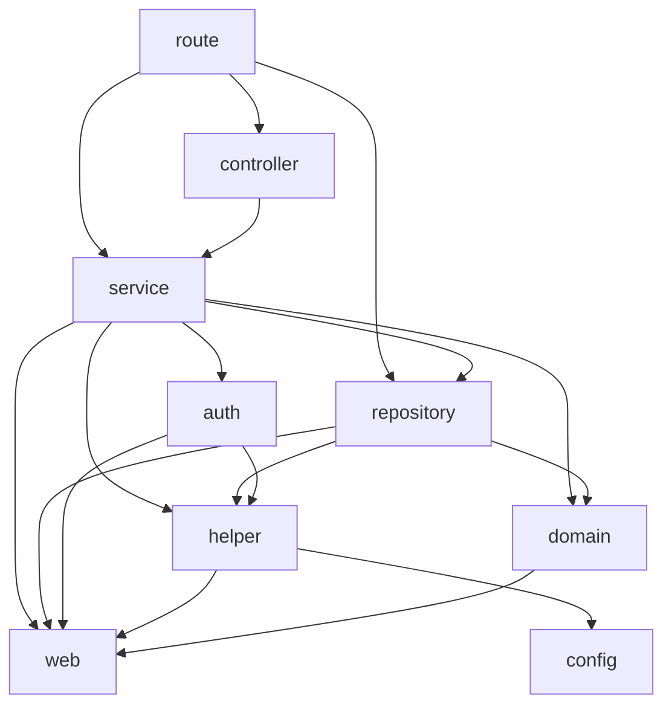

# Service Package Design, SOLID, dan Dependency Management — Refactoring Plan

> Status: rencana ini sudah dieksekusi lokal pada 27 September 2026. Perubahan belum di-commit.

**Goal:** memperjelas responsibility dan dependency service tanpa mengubah behavior, feature, kontrak API, atau transaksi existing.

**Architecture:** pertahankan package `service` dan pembagian file per responsibility yang sudah ada. Prioritaskan test kontrak serta dependency eksternal yang dapat diberikan per instance; tambah interface atau subpackage hanya ketika ada consumer dan manfaat yang nyata.

**Tech stack:** Go directive 1.23, Gin, GORM, validator, jwt-go, bcrypt, Redis/Firebase melalui helper, sqlmock dan testify. Versi modul tetap mengikuti `go.mod` existing.

**Baseline analisa:** commit `99ab87e`, 27 September 2026, branch `refactor/service-clean-code`. Semua 15 file Go dalam `service/` ditinjau bersama interface repository, route wiring, controller, auth/helper yang dipanggil, dan test terkait. `go list` digunakan untuk memeriksa import graph lokal; tidak ada import cycle yang dilaporkan pada paket yang diperiksa.

## Batasan global

- Catatan batasan ini menggambarkan fase analisa awal. Implementasi mengikuti batasan behavior dan dependency yang sama; tidak mengubah database atau Git metadata dan tidak commit/push.
- Implementasi mendatang mempertahankan method, constructor existing, JSON, status, error/panic identity dan message, nil/empty, sentinel, defaults, serta urutan efek samping.
- Tidak mengubah SQL, schema, tenant/company scope, actor ID, resolver, transaction ownership atau cancellation behavior sebagai efek samping cleanup.
- Tidak menambah framework DI, generic repository/service, service locator, mock generator, atau dependency baru.
- Test service tetap di `test/` melalui API publik. Jangan export parser/predicate/mapper hanya untuk akses test.
- Root `main_coverage_test.go` tetap sebagai test package main; memindahkannya memerlukan perubahan struktur kode di luar scope ini.
- Test yang sudah ada tetap dijalankan. Test baru menggantikan observasi yang rapuh hanya setelah seluruh skenarionya terwakili dengan assertion yang setara atau lebih kuat.
- Tidak menjanjikan bebas regression hanya berdasarkan persentase coverage. Database integration dan delivery eksternal tidak dibuktikan oleh sqlmock/fake.

## 1. Kesimpulan desain

**Belum perlu memecah `service` menjadi banyak subpackage.** Package ini memiliki lima service, wiring manual, dan belum menunjukkan kebutuhan deployment atau penggunaan ulang terpisah. Pemisahan file user sebelumnya memperbaiki navigasi, tetapi bukan pemisahan package atau dependency: seluruh method masih receiver `UserServiceImpl` yang sama.

Prioritas paling bernilai ialah memperjelas dependency efek eksternal login/session dan memperkuat test urutannya. Interface 14-method `UserService` memang luas, tetapi controller user saat ini memakai seluruh kelompok operasinya. Memecahnya sekarang menjadi sejumlah interface yang kemudian digabung kembali oleh caller yang sama tidak otomatis mengurangi coupling.

Referensi presence dipakai selektif: `../visit-flow-presence/service/user_lookup.go:8` menyediakan interface consumer `UserLookup` satu method yang benar-benar digunakan oleh beberapa workflow. Gateway `UserServiceImpl` memakai sebagian besar method repository user, sehingga menyalin pola itu menjadi banyak interface kecil belum tentu bermanfaat. Helper transaksi presence di `../visit-flow-presence/service/transaction.go:12` juga tidak boleh disalin karena mengganti topology reader/writer dan context gateway.

## 2. Inventory responsibility dan dependency

| Kelompok file | Responsibility saat ini | Dependency penting | Keputusan |
| --- | --- | --- | --- |
| `user_service.go`, `user_service_impl.go` | Kontrak user, constructor, reads/delete | UserRepository, SessionRepository, DB, validator, auth details | Pertahankan kontrak; dokumentasikan ownership |
| `user_profile.go` | Create/update, Telegram sync, mapping, upload pertama | UserRepository, bcrypt, filesystem, Gin untuk error Create | Cohesive sebagai profile; jangan buat service mapper/upload tersendiri |
| `user_password.go` | Reset/change password | UserRepository, bcrypt, transaction | Tetap terpisah secara file; tidak perlu interface password hasher sekarang |
| `user_login.go` | Lookup paralel, password verification, device decision, token/session, cache | Repository, auth.CreateToken, FCM, cache, goroutine | Kandidat utama dependency injection yang terbatas |
| `user_session.go` | Logout/check/refresh, parsing JWT, session mapping | Session/User repositories, GORM insert langsung, JWT/env/cache | Pertahankan flow; isolasi pemanggilan efek eksternal |
| `role_service.go`, `role_service_impl.go` | Role CRUD | RoleRepository, DB/resolver, validator, Gin/tracing | Tidak perlu abstraction CRUD umum |
| `user_role_service.go`, `user_role_service_impl.go` | Membership dan report akses | UserRoleRepository, resolver, Gin/tracing | Tetap bersama sampai report memiliki consumer/lifecycle sendiri |
| `role_menu_permission_service.go`, `role_menu_permission_service_impl.go` | Role-permission assignment | Repository, resolver, Gin/tracing | Tetap service kecil yang terpisah |
| `file_service.go`, `file_service_impl.go`, `slow_endpoint_parser.go` | File read/error mapping dan parsing teks | os/io, helper/exception, web DTO | Parser private tetap pure; filesystem diuji dengan temp file |

Bukti wiring: `route/users_route.go:14`, `route/role_route.go:14`, `route/user_role_route.go:14`, `route/role_menu_permission_route.go:14`, `route/file.go:12`. Route membangun repository, service, controller secara manual. Service tidak mengimpor controller/route dan tidak membangun repository sendiri.

### Graph dependency aktual (disederhanakan)



Graph tanpa cycle bukan berarti coupling rendah. `helper` menggabungkan cache, Firebase, SMTP, filesystem, HTTP, dan error handling; import package itu membawa dependency transitif yang lebih luas daripada fungsi yang dipakai service. Menaruh wrapper di file lain dalam package yang sama tidak menghilangkan import transitif. Plan ini menurunkan coupling saat menjalankan dan menguji service, bukan mengklaim menghapus dependency build Firebase/Redis.

`model/domain` juga mengimpor `model/web` untuk response mapping. Karena itu model existing bukan domain layer yang independen dari transport. Pemindahan seluruh mapper bukan bagian plan ini.

## 3. Penilaian Package Design dan SOLID

| Prinsip | Evidence / penilaian | Tindakan |
| --- | --- | --- |
| Cohesion / common closure | File login/session berubah bersama untuk rotasi token; profile/password punya alasan perubahan berbeda | Pertahankan file cohesive; jangan membuat package per method |
| Common reuse | File service tidak memakai DB, tetapi berbagi package dengan user/role | Kandidat split hanya bila file/parser dipakai consumer independen; belum ada bukti kebutuhan itu |
| Acyclic dependencies | Import graph lokal dapat dimuat; arah route/controller menuju service | Jangan membuat service mengimpor route/controller atau package fake/test |
| Stable dependencies | Service bergantung kontrak repository, tetapi tipe kontraknya membawa GORM/resolver dan web DTO | Akui coupling ini; jangan menamai arsitektur ini domain-pure/hexagonal |
| SRP | `UserServiceImpl` menggabungkan 14 operasi; file sudah terpisah | Perbaiki dependency dan test lebih dulu; extraction struct hanya bila ada kelompok consumer berbeda |
| OCP | Wiring manual dan repository interface sudah memungkinkan substitution | Variasi hanya di tempat nyata: production effects vs deterministic fake; tidak butuh plugin/strategy framework |
| LSP | Interface dan mock ada, tetapi error dapat berupa nil return, panic, atau empty response | Test substitusi wajib menjaga hasil, panic identity, handle transaksi, dan urutan operasi; compile saja tidak cukup |
| ISP | `UserService` 14 method; UserRepository 17; SessionRepository 5 | Jangan memecah interface tanpa memetakan pemakaian. Session consumer service hanya memanggil dua method repository, tetapi perubahan tipe field publik perlu audit compatibility |
| DIP | Repository/DB/validator diinjeksi; JWT, FCM, cache dan env dipanggil langsung | Dahulukan injeksi efek eksternal per instance. GORM konkret tetap dipertahankan sebagai batas pragmatis |

Bukti: `service/user_service.go:12`, `service/user_service_impl.go:13`, `repository/users_repository.go:11`, `repository/session_repository.go:8`, `service/user_login.go:58`, `service/user_login.go:96`, `service/user_login.go:137`, `service/user_session.go:61`.

Interface existing bukan otomatis berlebihan walau implementasi production hanya satu: controller/repository fake dalam `test/user_service_test.go`, `test/users_controller_coverage_test.go:73`, dan `test/gateway_misc_coverage_test.go:29` membuktikan adanya kebutuhan substitution untuk pengujian.

## 4. Kontrak existing yang harus dilindungi

| Flow | Urutan dan behavior yang dipertahankan |
| --- | --- |
| Login | Dua lookup paralel selesai → gagal lookup/password menghasilkan nil → keputusan device → jadwalkan notifikasi asynchronous → buat token → transaksi revoke/insert/update → commit sukses → set cache |
| Refresh | Validate → parse JWT (parse error menghasilkan response kosong) → claims checks → lookup user memakai FormatFloat id dengan satu desimal → lookup MR memakai structure ID → period check → buat token → consume/insert/update satu transaksi → set cache setelah sukses |
| Logout | Revoke session dan set access/refresh/device sentinel `-` dalam satu transaksi → invalidate cache setelah sukses |
| Profile | Validate → Begin → mkdir → aturan username/hash/timestamp existing → upload pertama → repository → response; posisi hashing sebelum rejection username tetap |
| Telegram | Telegram nol tetap clear + reload → lookup existing → update/create dengan defaults existing |
| Role | Resolver Read/Write, preliminary Begin, span, actor/filter existing tetap sampai task transaksi terpisah |
| File | Error open/read terpetakan persis; output kosong non-nil; Auth/Token terakhir menang; header timestamp mempengaruhi pemilihan entry |

Notifikasi **dijadwalkan** sebelum transaksi; goroutine tidak menjamin send/delivery selesai sebelum commit. Test tidak boleh menambahkan jaminan timing yang tidak dimiliki kode sekarang. `helper.SendFCMNotification` sendiri kembali meluncurkan goroutine (`helper/notification_helper.go:52`); jangan menghapus salah satu lapisan async tanpa analisa behavior tersendiri.

`SessionRepository.Create` memakai PanicIfError (`repository/session_repository_impl.go:19`), sementara login/refresh mengembalikan error insert dari callback GORM (`service/user_login.go:81`, `service/user_session.go:146`). Jangan mengganti direct insert dengan repository Create secara mekanis.

## 5. Struktur target minimal

```text
service/
  doc.go                         # ownership package, aturan dependency/transaksi
  user_service.go                # kontrak publik existing tetap
  user_service_impl.go           # dependency, constructor compatibility, reads/delete
  user_profile.go                # profile + mapping/upload private
  user_password.go               # password workflows
  user_login.go                  # login orchestration + device policy
  user_session.go                # refresh/logout/check + session mapping
  user_effects.go                # konfigurasi efek eksternal dan default existing
  role*_service*.go              # file role/permission existing
  user_role_service*.go          # file membership existing
  file_service*.go               # kontrak/read/error mapping file
  slow_endpoint_parser.go        # pure parser private
```

Hanya dua file production baru direncanakan: `doc.go` dan `user_effects.go`. Tidak menambah package `common`, `utils`, `interfaces`, `ports`, `managers`, atau subpackage domain kosong.

## 6. Tahap implementasi yang direkomendasikan

Setiap tahap diselesaikan dengan review diff; perubahan tetap lokal dan tidak di-commit.

### Tahap 1 — Kunci kontrak dan dependency inventory

**Files:** modify `test/user_service_coverage_test.go`, `test/session_refresh_coverage_test.go`; inspect seluruh route/controller dan `test/user_service_test.go`.

- [x] Catat semua pemanggil constructor, composite literal/type assertion terhadap struct implementasi, serta penggunaan field publik. Pencarian analisa ini tidak menemukan pemakaian `service.UserServiceImpl` langsung di luar service pada source Go repo, tetapi tetap ulangi saat implementasi.
- [x] Perketat assertion refresh: id `42` menghasilkan argumen lookup `"42.0"`; MR memakai `"S-01"`; consume memakai UUID input; user update memakai ID user hasil lookup.
- [x] Tambahkan failure test insert session, panic repository update, commit failure, dan consume false. ExpectRollback untuk failure sebelum commit; commit failure tidak diasumsikan menghasilkan sukses rollback. Cocokkan semantik GORM yang dipin.
- [x] Assert semua operasi write menerima instance `tx` yang sama, bukan root DB.
- [x] Pastikan login lookup tetap paralel dan refresh tetap sequential; jangan menggabungkan loader keduanya.

Contoh assertion konkret untuk refresh (memakai fixture existing `dataUser`, `userRepo`, `sessionRepo`):

```go
userIDText, structureID, refreshUUID := "42.0", "S-01", "refresh-rotation"
userRepo.On("JoinUserAndStructure", mock.Anything, &userIDText).
    Return(dataUser, structureID, "SUB", nil)
userRepo.On("JoinUserAndStructureMR", mock.Anything, &structureID).
    Return("MR", nil)
sessionRepo.On("ConsumeByRefreshUUID", mock.Anything, &refreshUUID).Return(true)
```

**Gate:** `go test ./test -count=1 -run 'TestUserService|TestSessionRepository'`. Characterization test harus lulus pada baseline; tidak perlu memaksa kegagalan dengan mengubah kode production. Assertion ini belum membuktikan cache/FCM order; itu ditambahkan melalui seam tahap 3.

### Tahap 2 — Perjelas package tanpa memindahkan public API

**Files:** create `service/doc.go`; modify import grouping pada `service/user_login.go`, `service/user_profile.go`, `service/user_session.go` bila masih bercampur.

- [x] Document bahwa service mengorkestrasi workflow, memiliki transaksi, menerima repository, dan menjaga panic compatibility.
- [x] Jelaskan file-per-responsibility tidak berarti subpackage/service terpisah.
- [x] Rapikan grouping standard library dan dependency eksternal pada file terdampak saja.
- [x] Pertahankan constructor/field/method exported dan seluruh interface existing.

Isi komentar package yang direncanakan:

```go
// Package service orchestrates the gateway's local identity, access, and file workflows.
// Services own transaction scope and preserve the existing panic-based error contract.
// Routes wire repositories and services; private helpers keep mapping and parsing local.
package service
```

**Gate:** `gofmt -l service`, `go vet ./...`, `go test ./test -count=1`. Tidak menambah abstraction atau dependency baru untuk tahap ini.

### Tahap 3 — Berikan dependency efek eksternal per instance user service

**Files:** create `service/user_effects.go`; modify `service/user_service_impl.go`, `service/user_login.go`, `service/user_session.go`, `test/user_login_device_test.go`; create `test/user_effects_test.go`.

**Alasan:** test keputusan device saat ini mengganti output logger global dan polling log (`test/user_login_device_test.go:61`). Cache order belum dapat diamati langsung. Tiga operasi eksternal memiliki production adapter dan fake recording yang nyata; function dependency cukup, tidak perlu tiga interface baru.

Kontrak additive yang direncanakan:

```go
type UserEffects struct {
    SendFCMNotification       func(token, title, body string)
    SetUserActiveToken        func(context.Context, uint, string, time.Duration)
    InvalidateUserActiveToken func(context.Context, uint)
}

func NewUserServiceWithEffects(
    users repository.UserRepository,
    sessions repository.SessionRepository,
    db *gorm.DB,
    validate *validator.Validate,
    effects UserEffects,
) UserService
```

- [x] Constructor existing `NewUserService` tetap persis signature dan default behavior-nya. Constructor additive menyimpan effects per instance melalui wrapper private, bukan package-global setter; layout field `UserServiceImpl` tetap kompatibel.
- [x] Default setiap function nil ialah fungsi helper existing. Jangan eager-load env, Redis client, Firebase client atau credentials saat construction: waktu lookup default harus tetap sama.
- [x] Default effects dibuat sebagai konfigurasi lokal tanpa lazy mutation shared state. Tidak ada panic constructor baru untuk dependency nil yang sebelumnya baru diperiksa ketika method dijalankan.
- [x] Audit pemakaian struct exported tidak menemukan consumer literal langsung. Untuk menjaga layout field publik, effects ditaruh pada wrapper private yang hanya dibuat constructor additive.
- [x] Berikan callback efek ke `notifyPreviousDevice` agar memakai konfigurasi instance. Predicate, token snapshot, pesan, log dan scheduling goroutine tetap; default callback tetap memanggil helper existing di titik yang sama.
- [x] Ganti hanya pemanggilan cache di login, refresh, logout dengan callback instance. Pertahankan TTL dan `context.Background()` existing; error cache tetap best-effort tanpa menggagalkan response.
- [x] Jangan menambah abstraction untuk jwt, bcrypt, clock, os, parser, atau validator dalam tahap ini. `auth.CreateToken` dan parseRefreshJWT tetap memakai implementasi existing.
- [x] Recording fake FCM mengirim event ke buffered channel; test memakai select dengan timeout terbatas. Jangan memakai sleep atau membaca logger sebagai oracle keputusan notification.
- [x] Pertahankan seluruh case matrix device existing, tambah old-token nil dan device whitespace yang menjadi sentinel. Assert isi token/pesan tanpa mengirim FCM nyata.
- [x] Fake cache memeriksa hasil callback transaksi: tidak dipanggil pada insert/update/commit failure; dipanggil sekali setelah commit berhasil. Assert TTL, user ID, access token, dan invalidation logout.
- [x] Jalankan dua instance service dengan fake berbeda untuk membuktikan konfigurasi tidak bocor antar instance. Hindari `t.Parallel` pada test yang masih mengubah env/global dependency lain.

**Gate:** focused login/session/effects tests, lalu `go test -race ./... -count=1`. Tidak mengubah production route wiring karena constructor existing mengisi default; constructor additive menyediakan composition seam bagi caller yang perlu memilih efek.

**Batas desain:** `UserEffects` hanya kumpulan tiga efek user workflow, bukan wadah semua dependency. Jika konfigurasi ini terus tumbuh atau mulai dipakai workflow lain dengan kebutuhan berbeda, evaluasi pemisahan yang lebih cohesive sebelum menambah field.

### Tahap 4 — Audit interface, pertahankan yang memberi manfaat

**Files:** inspect `service/*_service.go`, `repository/*repository.go`, `controller/*_impl.go`, `route/*.go`, seluruh mock di `test/`; update `service/doc.go` hanya bila perlu menjelaskan keputusan.

- [x] Pertahankan lima service interface dan constructor existing karena caller/mock menggunakannya.
- [x] Jangan membuat `UserReader`, `UserWriter`, `PasswordService`, `LoginService`, dan `SessionService` hanya untuk memecah 14 method lalu memasukkannya kembali ke controller yang sama.
- [x] Jangan memperkenalkan interface untuk mapper/parser/bcrypt; gunakan fungsi konkret private dan test workflow publik.
- [x] Catat candidate `SessionStore` hanya untuk consumer terpisah yang benar-benar menggunakan `DeleteByUserID` dan `ConsumeByRefreshUUID`. Jangan ubah tipe field publik `SessionRepository` pada tahap ini; caller bisa menggunakan method lain melalui field tersebut.
- [x] Pertahankan return type constructor existing meskipun constructor baru biasanya dapat mengembalikan concrete type. Mengubah semuanya demi slogan Go bukan perbaikan kompatibilitas.

**Gate:** tidak menambah interface baru tanpa daftar consumer, production implementation, fake, dan pengurangan dependency yang dapat ditunjukkan. Tidak perlu memaksa perubahan kode jika hasil audit menyimpulkan kontrak existing cukup.

### Tahap 5 — Review akhir dan dokumentasi

**Files:** test yang ditambah/diubah; plan ini sebagai catatan status. Tidak mengedit schema, konfigurasi production, atau modul.

- [x] Bandingkan signature, JSON/status/error, query arguments, nil/empty/defaults, ordering dan transaksi dengan baseline.
- [x] Pastikan parser tetap private, business flow terbaca top-down, dan tidak ada package/service baru yang hanya pass-through.
- [x] Pastikan notification test tidak lagi bergantung global logger atau polling waktu; helper production tetap memiliki semantik async existing.
- [x] Pertahankan test existing; jangan menghapus assertion untuk menaikkan coverage atau menghilangkan failure.
- [x] Catat hasil perintah aktual dan batas evidence; jangan menandai tahap selesai hanya karena test aggregate lulus.

Perintah verifikasi pada saat implementasi, bukan klaim sudah dijalankan pada tahap analisa ini:

```bash
go test ./test -count=1 -run 'TestUserService|TestVerifyPassword|TestSessionRepository|TestFileService'
go test ./... -count=1
go test -race ./... -count=1
go vet ./...
go build -o /tmp/visit-flow-api-gateway-package-design-check .
staticcheck ./...
gocritic check ./...
go test ./... -count=1 -coverpkg=./... -coverprofile=/tmp/visit-flow-api-gateway-package-design-coverage.out
go tool cover -func=/tmp/visit-flow-api-gateway-package-design-coverage.out
git diff --check
```

Gunakan path `/tmp` untuk coverage bila tidak ingin updater README. `make cover`/`make check-all` adalah opsi valid jika pembaruan README diinginkan; keduanya punya efek menulis artifact/README. Tes harus memakai kredensial sintetis, SQL mock, dan fake notification/cache; audit efek suite existing sebelum menjalankan, jangan menggunakan credential production.

## 7. Dependency management tingkat modul

- `go.mod` menyatakan Go 1.23, jwt-go v3.2.0, GORM v1.25.2, go-helper v0.5.6 dan Redis v9.7.0. Ini inventory source, bukan pernyataan versi terbaru atau status vulnerability.
- Tidak ada `go get`, upgrade, `go mod tidy`, penggantian JWT library, ataupun penghapusan indirect module dalam plan ini.
- Kehadiran jwt-go dan golang-jwt/v4 sekaligus di graph tidak membuktikan dependency redundant: yang kedua tercatat indirect. Jika audit dependency diminta nanti, gunakan `go mod why -m`/graph sebelum keputusan.
- Modul private `gitlab.com/VNEU/go-helper` mengikat resolver, pagination dan tracing; jangan membuat salinan DTO/transaction wrapper hanya agar import hilang.
- Dependency upgrade/security audit menjadi task terpisah dengan changelog library, compile/test, compatibility token serta batas versi Go yang diverifikasi sendiri.

## 8. Perubahan yang ditunda beserta alasan

| Kandidat | Alasan tidak menjadi tahap awal | Trigger untuk ditinjau kembali |
| --- | --- | --- |
| `service/user`, `service/access`, `service/files` | Package move menyentuh import, nama exported dan semua wiring; belum ada consumer independen | Consumer/reuse terpisah atau coupling nyata yang tidak dapat diperbaiki dalam package existing |
| Memecah UserServiceImpl menjadi struct profile/session | Berpotensi facade pass-through, duplikasi dependencies, dan migrasi field publik | Controller/job berbeda membutuhkan kelompok operasi berbeda dan dapat menerima interface kecil |
| Narrow repository interface massal | User service memakai mayoritas repository methods; field publik membawa compatibility | Consumer nyata membutuhkan subset kecil seperti UserLookup presence |
| Memindahkan AccessDetails dari auth atau response mapper dari domain | Perubahan lintas package/model/controller yang besar | Migrasi transport/auth tersendiri dengan contract coverage |
| Mengganti semua Gin context dengan context.Context | Mempengaruhi tracing, response error, cancellation dan signature | Task end-to-end controller-service-repository khusus |
| Menggabungkan transaksi role dengan user/presence | Topology resolver dan finalization berbeda | Review transaksi + MySQL integration terpisah |
| Memindahkan session insert ke repository Create existing | Panic berbeda dari callback-return-error | Perubahan repository kontrak terukur dengan failure tests |
| Menghapus field validator role-membership yang tidak dipakai | Field dan constructor exported; manfaat kecil dibanding source churn | Migrasi constructor publik terencana |
| Mengubah notification menjadi after-commit/outbox | Perubahan behavior/lifetime/delivery | Business requirement yang eksplisit |
| Menghapus logging token/device atau memperbaiki actor/filter/defaults | Perubahan efek/behavior existing, bukan organisasi package | Task security/bugfix tersendiri |

## 9. Acceptance criteria dan batas evidence

- [x] Tidak ada perubahan feature/HTTP/error/DB behavior existing.
- [x] Semua test existing tetap berjalan; targeted failure/order assertions lulus.
- [x] Dependency eksternal yang diubah dapat dikonfigurasi per instance tanpa global hook.
- [x] Tidak ada interface baru yang hipotetis; tidak ada package baru sekadar penataan folder.
- [x] Repository/transaction workflow tetap jelas di service, tidak disembunyikan framework.
- [x] Default constructor dan default effects tetap menjalankan implementasi existing.
- [x] go.mod/go.sum, SQL, schema, route endpoints, dan production configuration tidak berubah.
- [x] Dokumentasi menyebut hasil aktual, bukan jaminan production dari coverage.

Pada fase analisa awal, test tidak dijalankan ulang, live database/Firebase/Redis tidak diakses, dan dependency vulnerability audit tidak dilakukan. Pengujian implementasi yang benar-benar dijalankan tercatat di bawah. Working tree saat awal analisa hanya berisi dokumen plan ini.

### Hasil eksekusi

- `go test ./... -count=1` — lulus.
- `go test -race ./... -count=1` — lulus.
- `go vet ./...` — lulus.
- `go build -o /tmp/visit-flow-api-gateway-package-design-check .` — lulus.
- `staticcheck ./...` dan `gocritic check ./...` — lulus setelah perbaikan temuan `ifElseChain` pada test baru.
- `go test ./... -count=1 -coverpkg=./... -coverprofile=/tmp/visit-flow-api-gateway-package-design-coverage.out` — lulus; ringkasan `go tool cover` menunjukkan 95.4% statement aggregate.
- `git diff --check` — lulus.
- Tidak ada akses database live, Redis, atau Firebase; test efek memakai sqlmock dan fake. Ini memverifikasi orkestrasi lokal, bukan delivery layanan eksternal.
- Perubahan belum di-commit atau di-push.
