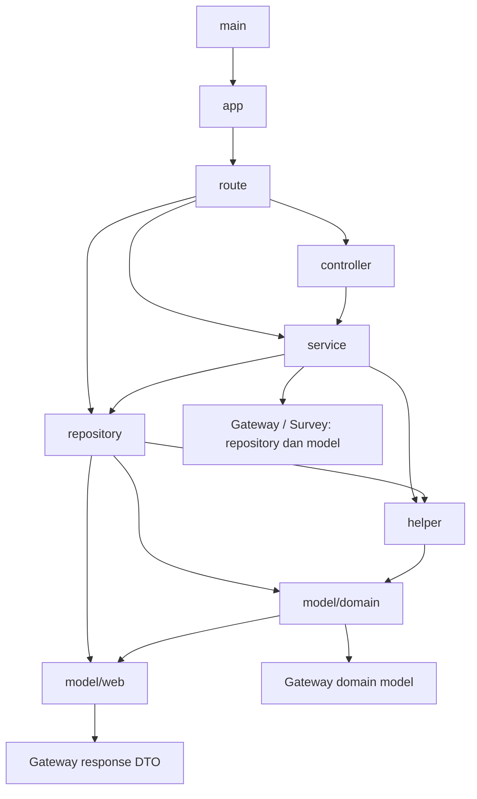

# Plan refactor Package Design, SOLID, dan Dependency Management

Tanggal analisis: 27 September 2026. Target: `visit-flow-go`.
Status: **analisis dan plan saja; belum diimplementasikan**.

## Keputusan utama

Pertahankan struktur layer yang ada sambil memperjelas dependency dan responsibility secara bertahap. Jangan langsung memindahkan semua fitur ke struktur baru. Prioritas pertama adalah dependency yang dibuat tersembunyi di dalam service, campuran business flow dengan I/O, dan kontrak yang terlalu besar untuk kebutuhan konsumennya.

Gunakan satu fitur kecil sebagai pilot pemisahan package. Interface dibuat hanya ketika ada kebutuhan substitusi nyata, termasuk adapter produksi dan fake untuk pengujian. Tidak perlu membuat interface untuk setiap struct, mapper, atau helper. Public interface, constructor, DTO, dan manual route wiring existing tetap kompatibel.

Plan ini melengkapi [plan readability service sebelumnya](2026-09-27-visit-flow-go-service-clean-code.md). Pemecahan function tidak otomatis memperbaiki hubungan antar-package. Perubahan existing dari pekerjaan sebelumnya harus dipertahankan.

## Cakupan dan kualitas bukti

Analisis memetakan seluruh package melalui `go list`, import graph, deklarasi interface, wiring, serta penelusuran source pada flow yang menunjukkan masalah arsitektur. Ini bukan pembuktian setiap cabang business logic atau audit schema/runtime produksi.

Snapshot normal build pada saat analisis, sebelum test approval tracking ditambahkan: **12 package, 491 file Go non-test, dan 62 file test**. Hitungan mengikuti file aktif yang ditemukan Go pada environment analisis, bukan seluruh kemungkinan build tag/platform; source saat ini memiliki satu file test tambahan dari penguatan R1. Graph import lokal pada saat analisis tidak memiliki cycle.

| Package | File non-test | File test | Dependency lokal langsung pada normal build |
|---|---:|---:|---|
| root / main | 1 | 0 | app |
| app | 2 | 0 | helper, route |
| auth | 2 | 0 | — |
| configuration | 1 | 0 | — |
| controller | 78 | 0 | auth, helper, model/web, service |
| helper | 25 | 2 | model/domain |
| model/domain | 52 | 0 | model/web |
| model/web | 108 | 0 | — |
| repository | 87 | 3 | helper, model/domain, model/web |
| route | 39 | 0 | auth, controller, repository, service |
| service | 96 | 11 | auth, helper, model/domain, model/web, repository |
| test | 0 | 46 | Import test tidak ditampilkan di kolom normal build |

Terdapat **121 deklarasi interface**: controller 39, service 39, repository 43. Jumlah ini merupakan inventaris, bukan bukti bahwa semuanya harus dihapus atau dipecah.

### Graph existing — hubungan utama



Diagram menyoroti hubungan relevan; bukan daftar setiap import. Graph tanpa cycle masih dapat mempunyai coupling yang tinggi melalui public types, side effects, dan constructor tersembunyi.

## Temuan dan implikasi

### 1. Dependency injection sudah ada, tetapi belum konsisten

[VisitRoute](../../route/visit_route.go:15) membuat VisitService dengan 12 parameter: 10 repository, DB, dan validator. [VisitServiceImpl](../../service/visit_service_impl.go:29) menyimpan dependency tersebut, tetapi banyak method masih membuat repository konkret sendiri.

Contohnya terdapat pada [visit planning](../../service/visit_plan.go:47), [customer](../../service/customer_service_impl.go:63), [location](../../service/location_service_impl.go:67), dan [visit-customer commands](../../service/visit_customer_commands.go:21). Akibatnya, daftar dependency constructor belum mewakili kebutuhan flow secara lengkap dan pengujian sulit mengganti dependency tertentu.

Kasus khusus: ConfirmationStatusRepository diterima constructor, sedangkan [Approval](../../service/approval.go:11) membuat implementation konkret sendiri. Mengalihkan helper langsung ke field injected dapat mengubah perilaku caller/fake existing. Kunci perilaku default dan panggilan dependency terlebih dahulu.

**Arah:** explicit dependency per use case; jangan menambah semua repository ke satu constructor raksasa. Pertahankan constructor existing sebagai compatibility entry point dan letakkan default wiring di titik konstruksi, bukan fallback tersembunyi di setiap method.

### 2. Interface mengikuti layer/entitas, bukan selalu kebutuhan consumer

[VisitService](../../service/visit_service.go:12) memiliki 25 method; [VisitRepository](../../repository/visit_repository.go:9) memiliki 27. Ini membuat consumer kecil mengetahui kontrak yang luas.

[Test mock](../../test/mocks_test.go:12) meng-embed interface repository luas dan hanya mengimplementasikan method tertentu. Bila method promoted yang belum disediakan terpanggil melalui interface embedded nil, kegagalannya terjadi saat runtime. Ini alasan untuk membuat seam pengujian lebih kecil, bukan bukti bahwa implementation produksi melanggar LSP.

**Arah:** interface kecil milik consumer untuk flow yang benar-benar membutuhkan substitusi. Repository konkret dapat memenuhinya secara implisit. Pertahankan public interface existing selama migrasi. [SocialService](../../service/social_service.go:3) yang hanya satu method sudah merupakan kontrak kecil; tidak perlu dipecah lagi.

### 3. Persistence model dan response mapping saling terikat

[Visit model](../../model/domain/visit.go:7) mengimpor DTO web dan memiliki `ToVisitResponse` serta `ToVisitTempResponse` dengan pemetaan berbeda. [Structure](../../model/domain/structure.go:4) mengandung model User dari gateway dengan relasi GORM; [StructureResponse](../../model/web/structure_response.go:4) mengekspos response User dari gateway.

[VisitCustomerRepository](../../repository/visit_customer_repository.go:16) menerima request web pada validasi/count dan mengembalikan projection response pada method lain. Request HTTP penuh menciptakan coupling lebih kuat daripada projection query sederhana; keduanya tidak perlu diperlakukan sama.

**Arah:** pertahankan model/DTO saat tahap awal. Narrow parameter repository hanya pada flow terpilih dengan compatibility wrapper. Jangan membuat tiga salinan model untuk memenuhi pola arsitektur.

Memindahkan mapper ke package baru lalu membuat method lama memanggil mapper tersebut akan menghasilkan cycle apabila mapper mengimpor domain. Type alias juga tidak otomatis menghilangkan dependency/method existing. Pemisahan total domain–web memerlukan migrasi khusus dan keputusan kompatibilitas public method; ditunda dari batch awal.

### 4. Responsibility I/O tercampur

- [Google Maps proxy](../../service/google_maps_service_impl.go:78) melakukan HTTP request sekaligus menulis header, status, dan body Gin.
- [CreateFileJsonCityData](../../repository/structure_cities_repository_impl.go:86) menggabungkan query DB, direktori/file, JSON encoding/decoding, dan ekstraksi data. Parameter Gin context tidak digunakan dalam body yang diperiksa.
- [CSV helper](../../helper/get_data_csv.go:13) mencampur HTTP context, file, DB, dan model.
- [Notification helper](../../helper/send_message.go:14) menginisialisasi Firebase dan menyusun payload. Varian helper mempunyai aturan token kosong dan payload berbeda.

Cache kota tersebut **tetap mengambil DB dan menulis ulang file** pada flow existing; bukan cache-hit yang melewati DB. [Test refresh cache](../../repository/structure_cities_cache_test.go:13) mengunci hal ini. Pemisahan responsibility tidak boleh menjadi perubahan kebijakan cache.

**Arah:** pisahkan orchestration dari I/O pada fitur terpilih; helper umum hanya untuk operasi yang benar-benar umum. Jangan membuat package `utils`, `common`, atau `manager` baru sebagai tempat penumpukan.

### 5. Coupling ke sibling module mencakup repository, model, dan DTO

Core memakai gateway `v0.0.84-release`, survey `v0.0.13-release`, dan go-helper `v0.5.9` dari module dependency terpilih. Source sibling checkout lokal bukan otomatis kode yang digunakan build core.

[Checkout](../../service/visit_checkout.go:42) memanggil repository survey secara in-process menggunakan `tx.Read`. Menggantinya dengan HTTP bukan refactor struktural: transaction visibility, failure mode, dan latency berubah.

**Arah:** adapter lokal sempit dapat membatasi lokasi import repository sibling. Tetapi adapter itu belum menghapus dependency transitif selama model dan response masih menggunakan type gateway. Jangan menjanjikan isolasi total setelah hanya membungkus repository.

### 6. Bootstrap dan utility perlu penataan selektif

[Router](../../app/router.go:29) dan route sudah menjadi tempat manual wiring yang dapat dipertahankan. Tidak perlu DI container/framework atau service locator.

Package `helper` mengimpor domain, sehingga ia bukan utility independen. Menambahkan import helper dari domain kelak dapat menciptakan cycle. Pisahkan hanya responsibility yang memang mempunyai cohesion, bukan setiap file menjadi package.

Package `configuration` tidak ditemukan sebagai import lokal normal build; main menggunakan loader eksternal. Ini kandidat pemeriksaan pemakaian, bukan dasar penghapusan public package. Demikian pula helper transaksi lokal mempunyai caller test; jangan menghapus berdasarkan tidak adanya caller produksi lokal saja.

## SOLID diterapkan secara pragmatis

| Prinsip | Penilaian existing | Tindakan yang bernilai |
|---|---|---|
| SRP | Service/repository/helper tertentu mencampur orchestration, HTTP, file, dan integrasi | Pisahkan berdasarkan alasan perubahan: aturan use case, persistence, transport, integrasi |
| OCP | Dependency konkret tersembunyi menyulitkan mengganti adapter saat test | Sediakan seam hanya untuk dependency yang benar-benar diganti; tanpa plugin/workflow framework |
| LSP | Kontrak mencakup panic, nilai kosong, side effect, DB handle, dan urutan panggilan | Fake dan adapter harus mempertahankan semantik itu; perkuat characterization test, bukan sekadar kesamaan signature |
| ISP | Beberapa interface luas; test mengimplementasikan sebagian | Interface consumer kecil pada use case terpilih; kontrak exported existing tetap tersedia |
| DIP | Constructor injection bercampur instansiasi konkret dalam business flow | Pindahkan pilihan implementation ke wiring; consumer menerima dependency yang diperlukan |

SOLID bukan alasan meniru hierarki class Java. Gunakan fungsi, struct konkret, composition, dan implicit interface Go. Tidak semua dependency harus dibungkus interface.

## Struktur tujuan bertahap

Layer existing tetap menjadi jalur utama. Package internal ditambahkan hanya setelah pilot membuktikan manfaat:

```text
app/                         bootstrap existing
route/                       route dan manual dependency wiring
controller/                  parsing dan response HTTP
service/                     public contracts + business orchestration existing
repository/                  SQL/GORM dan compatibility contracts
model/domain/, model/web/    model/DTO existing, kompatibel
helper/                      helper existing; sebagian menjadi compatibility wrapper
internal/social/             kandidat pilot: pemeriksaan akun + klasifikasi
internal/notification/       kandidat berikutnya: payload/transport notifikasi
internal/integration/...     hanya adapter sibling yang dibutuhkan use case terpilih
```

Nama dan jumlah package internal final ditentukan setelah melihat kebutuhan pilot. Jangan membuat seluruh direktori kosong di awal. Hindari `internal` package mengimpor facade `service`/`helper` yang memanggilnya kembali. Compatibility wrapper sebaiknya satu arah dan hanya satu implementation business logic.

Tidak merencanakan pemecahan Go module, `go.work`, microservice baru, generic repository/service, transaction framework, atau penggantian Gin/GORM.

## Urutan pelaksanaan yang disarankan

Setiap batch dapat direview mandiri. Tidak ada instruksi commit dalam plan ini.

### P0 — Baseline dan kontrak (wajib sebelum source berubah)

**Gate tambahan dari [audit regression mendalam](2026-09-27-visit-flow-go-regression-audit.md):** kelemahan test approval telah diperbaiki dan no-op mutation kini gagal dalam test terisolasi. Sisa P0 sebelum implementasi arsitektur: kunci checkout survey/upload serta rollover dengan waktu deterministik, bedakan Read/Write pada test transaksi, dan verifikasi hasil notifier. Full suite hijau atau coverage tinggi saja tidak memenuhi P0.

1. Catat dependency/caller untuk flow yang dipilih, termasuk exported struct fields, constructor return type, interface, dan caller test.
2. Jalankan baseline test/vet pada source saat eksekusi dimulai. Pisahkan kegagalan existing dari perubahan baru.
3. Tambahkan characterization test hanya untuk celah perilaku yang disentuh: response, error/panic, urutan dependency, DB handle, dan side effects.
4. Simpan inventaris import dan exception legacy sebagai baseline. Rule arsitektur awal melarang pelanggaran baru, bukan memaksa semua debt lama diselesaikan sekaligus.

**Selesai bila:** kontrak pilot tercatat, test deterministik dapat dijalankan tanpa layanan produksi, dan failure baseline dipahami.

### P1 — Pilot package kecil: social (risiko rendah–menengah)

Target: `social_service_impl.go`, `social_response_classification.go`, test terkait, dan kandidat `internal/social`.

- Pindahkan pemeriksaan akun dan klasifikasi sebagai satu responsibility yang kohesif.
- Gunakan struct konkret; tambahkan consumer interface HTTP minimal hanya untuk produksi/fake yang dibutuhkan.
- Pertahankan `NewSocialService`, `SocialService`, exported constants dan perilaku direct construction existing. Facade lama mendelegasikan ke satu implementation.
- Pertahankan normalisasi username, platform alias, pesan, precedence deteksi, timeout 20 detik, limit body, retry/sleep, header, dan redirect policy existing.
- Jangan sekaligus menambah cancellation/timeout policy baru atau mengganti HTTP client lifecycle.

**Verifikasi:** fixture HTTP untuk setiap platform, response kosong/malformed, non-success, error jaringan, dan klasifikasi yang ambigu. Existing assertions tetap dipertahankan. Lanjutkan pola hanya bila navigasi source dan test lebih sederhana.

### P2 — Dependency eksplisit per use case (risiko menengah)

Pilot pertama: approval status lookup; berikutnya visit planning. Customer/location menyusul dengan pola yang sudah terbukti.

- Identifikasi dependency konkret yang dibuat di dalam flow.
- Buat interface kecil di sisi consumer atau typed function bila hanya satu operasi dan lebih jelas.
- Susun dependency pada titik konstruksi. Pertahankan old constructor; penambahan constructor/dependency struct hanya bila diperlukan untuk jalur kompatibel, tanpa global container.
- Jangan mengubah 12 parameter VisitService menjadi puluhan parameter. Pisahkan kolaborator use case, bukan sekadar mengemas semua field ke struct bernama `Dependencies`.
- Tangani ConfirmationStatusRepository yang injected tetapi tidak digunakan dengan test khusus; jangan berasumsi semua caller mendapat behavior sama setelah pengalihan.

**Verifikasi:** dependency call order, parameter scope, panic/error persis, pointer DB/resolver yang diteruskan, dan behavior caller default/fake. Tidak ada concrete repository baru di dalam flow yang selesai dimigrasikan.

### P3 — Pisahkan I/O yang paling bercampur (batch terpisah, risiko menengah)

**P3a: city file data.** Pisahkan query repository dan pengolahan file khusus fitur. Pertahankan refresh DB, path, urutan create/write/open/read, mapping JSON, close/error behavior, serta data province/city. Jangan menggabungkan dengan cache service lain hanya karena sama-sama file JSON.

**P3b: notification.** Pertahankan helper exported sebagai wrapper; pindahkan implementation kohesif ke package khusus. Test setiap varian payload dan aturan token kosong. Client caching, inisialisasi sekali di bootstrap, perubahan urutan notifikasi versus commit, dan async delivery bukan bagian batch ini.

**P3c: Google Maps.** Pisahkan pengambilan hasil upstream dari penulisan response; facade existing tetap kompatibel sampai controller dimigrasikan. Kunci status, header, body, dan error envelope. Tidak mengubah timeout atau redirect bersamaan.

**P3d: CSV.** Pisahkan query dan pemrosesan file bila flow ini menjadi target berikutnya. Nilai filter/policy existing tidak diperbaiki diam-diam atas nama cleanup.

**Selesai bila:** business flow terbaca dari atas ke bawah, efek eksternal terlihat eksplisit, dan tidak ada duplikasi implementation di wrapper lama/baru.

### P4 — Batasi import sibling pada use case terpilih (risiko menengah–tinggi)

- Mulai dari satu operasi survey saat checkout atau lookup user yang terlokalisasi.
- Consumer menentukan operasi minimum; adapter memanggil repository module yang sama dengan DB handle yang sama.
- Pertahankan `tx.Read`, `tx.Write`, atau base DB sesuai panggilan existing. Jangan mengganti dengan HTTP ataupun menggabungkan transaksi.
- Gunakan public type existing pada tahap kompatibilitas bila diperlukan. Penggantian type gateway pada model/DTO menjadi proyek tahap lanjut dengan uji JSON/GORM tersendiri.

**Selesai bila:** import repository sibling berkurang pada flow yang dimigrasikan, dependency terlihat pada wiring, dan exception model/DTO yang belum selesai dicatat jujur.

### P5 — Interface, query input, dan helper selektif (risiko menengah)

- Gunakan hasil P2 untuk memperkecil kebutuhan consumer/mocks, bukan memecah seluruh 121 interface.
- Request web penuh pada repository dapat diganti parameter minimum pada jalur internal, dengan wrapper public existing dan validasi tetap pada urutan semula.
- Pertahankan projection query yang masuk akal; jangan membuat type duplikat hanya untuk menghilangkan satu import.
- Hapus interface/package exported hanya setelah audit caller dan keputusan kompatibilitas terpisah. Mengubah constructor return type juga dapat memutus assignment function meskipun caller biasa masih compile.
- Pecah helper berdasarkan responsibility nyata. Utility murni baru tidak boleh mengimpor domain, web, Gin, atau DB tanpa alasan fitur yang jelas.

**Selesai bila:** dependency setiap flow dapat dipahami dari konstruksinya dan test tidak perlu mock puluhan method yang tidak digunakan.

### P6 — Evaluasi pemisahan model–web dan layout fitur (ditunda, risiko tinggi)

Jalankan hanya bila manfaat dari pilot menunjukkan kebutuhan nyata. Sebelum memindahkan mapper/model, petakan public method, GORM tags/relations/TableName, JSON/null/ordering, dan nested gateway User. Tentukan strategi yang bebas cycle dan tidak memutus public caller. Bila kompatibilitas mengharuskan legacy edge tetap ada, pertahankan edge tersebut; jangan memaksa arsitektur ideal.

Tidak ada persetujuan tersirat dalam plan ini untuk rewrite seluruh package menjadi struktur vertikal.

## Dependency management

1. Pertahankan versi pinned dan Go version existing selama refactor struktural. Tidak menjalankan `go get -u` atau mengganti sibling module dengan local checkout.
2. Tinjau import langsung versus transitif melalui `go list`; ukuran dependency graph bukan otomatis masalah performa/security.
3. Sesudah pemindahan package, `go mod tidy` hanya sebagai perubahan terpisah dengan pemeriksaan diff dependency. Jangan menjalankan target tidy sebagai housekeeping analisis.
4. `go mod verify` memeriksa checksum module cache; bukan audit kerentanan dan bukan bukti kompatibilitas runtime.
5. Upgrade library dan audit vulnerability dibuat tugas tersendiri agar regression dapat dikaitkan dengan perubahan yang jelas.
6. Tetap manual wiring. Hindari service locator, singleton baru, dan package config global tambahan.
7. Tambahkan pemeriksaan import ringan bila perlu untuk menjaga arah package baru: internal social tidak mengimpor Gin/service/repository; integration adapter tidak mengimpor controller; utility murni tidak bergantung pada domain. Catat legacy exceptions, hindari framework lint arsitektur baru.

## Kontrak yang tidak boleh berubah

- Route, auth/middleware order, validasi, status HTTP, pesan/type error, dan panic recovery.
- JSON keys/types, null/zero, slice nil versus kosong, ordering, pagination, dan response envelope.
- Tenant/company, structure/subordinate, ownership, soft-delete, period, dan checkpoint filter.
- Urutan query/mutasi, DB handle Read/Write/base, nested transaction, dan rollback/commit boundary.
- Semantik `recover()`: pemindahan deferred function tidak boleh membuat recover menjadi panggilan tidak langsung yang gagal menangkap panic.
- Perubahan request/model in-place, default value, timezone, dan pembacaan waktu yang memengaruhi hasil.
- Notifikasi: payload, kondisi kirim, aturan token kosong, urutan terhadap write/commit, dan error/init timing.
- File: path, overwrite/refresh, encoding, urutan operasi, dan kegagalan yang tampak pada caller.
- HTTP upstream: timeout, retry, redirect, header, status/body dan precedence klasifikasi.

Debt seperti transaksi read belum difinalisasi, notifikasi sebelum commit, ignored error, dan cancellation yang belum diteruskan harus dicatat terpisah bila ditemukan. Memperbaikinya dapat bermanfaat, tetapi mengubah behavior dan tidak boleh disisipkan dalam refactor mekanis ini.

## Strategi verifikasi saat implementasi nanti

Untuk setiap batch: characterization test yang relevan → perubahan kecil → focused test → seluruh existing test dan vet. Gunakan `go test -mod=readonly ./... -count=1 -timeout=180s` dan `go vet ./...` dari child repository, disesuaikan dengan quality gates repository yang berlaku saat eksekusi. Race test ditargetkan bila state bersama/concurrency disentuh.

Pertahankan existing test dan kekuatan assertion. Jangan menghapus test atau melemahkan SQL expectation agar pemindahan package terlihat lulus. Test baru menargetkan kontrak observable, bukan menyalin langkah implementation.

Gunakan fixture HTTP, fake notifier, temporary directory, dan fasilitas SQL mock existing. Tidak mengirim FCM atau memanggil layanan produksi untuk validasi refactor. SQL mock tidak membuktikan isolation/replication MySQL; integration test memerlukan environment terisolasi dan aturan otorisasi database workspace tetap berlaku.

Rollback dilakukan per batch melalui pembatalan edit milik batch secara terkontrol setelah mengenali perubahan pengguna; tidak ada instruksi reset/checkout/commit dalam plan ini. Jika behavior berubah tanpa disengaja, hentikan perluasan scope dan pulihkan batch sebelum melanjutkan.

### Definition of done per batch

- Responsibility dan alasan dependency dapat dijelaskan dengan singkat.
- Orchestration terbaca berurutan; helper mempunyai satu tujuan, bukan sekadar mengejar jumlah baris.
- Tidak ada public contract atau business behavior yang berubah tanpa scope terpisah.
- Existing test tetap tersedia dan lulus; assertion perilaku berisiko yang disentuh mempunyai coverage relevan.
- Tidak ada import cycle, abstraction spekulatif, duplicate implementation, atau dependency library baru tanpa kebutuhan.
- Hasil test, batas verifikasi, dan sisa legacy coupling dilaporkan secara eksplisit.

## Verifikasi pada tahap analisis ini

- `go list -mod=readonly -json ./...`: berhasil; dipakai untuk inventaris package/import.
- `go list -mod=readonly -deps -json ./...`: berhasil; dependency build dapat di-resolve.
- Pemeriksaan graph import lokal: tidak ada cycle.
- `go mod verify`: berhasil, `all modules verified`.
- Aplikasi/test tidak dijalankan ulang pada tahap plan ini. Hasil test dari pekerjaan sebelumnya adalah bukti historis, bukan hasil baru untuk source snapshot ini.
- Tidak ada perubahan source, test, go.mod, atau go.sum dari analisis ini; diverifikasi terhadap manifest hash awal analisis.
- Tidak menjalankan operasi Git, database, atau integrasi produksi selama analisis. Atas permintaan pengguna setelahnya, salinan plan ini dimasukkan ke child repository pada branch dokumentasi; tidak ada perubahan source atau test dari tahap analisis ini. Artefak analisis lain berada sementara di `/tmp`.

Prioritas pelaksanaan yang direkomendasikan: **P0 → P1 → P2 → P3 per fitur → P4/P5 sesuai manfaat**. P6 tetap ditunda. Urutan ini mengurangi coupling dengan perubahan yang dapat diuji dan direview, tanpa menjadikan pemindahan direktori sebagai tujuan utama.
